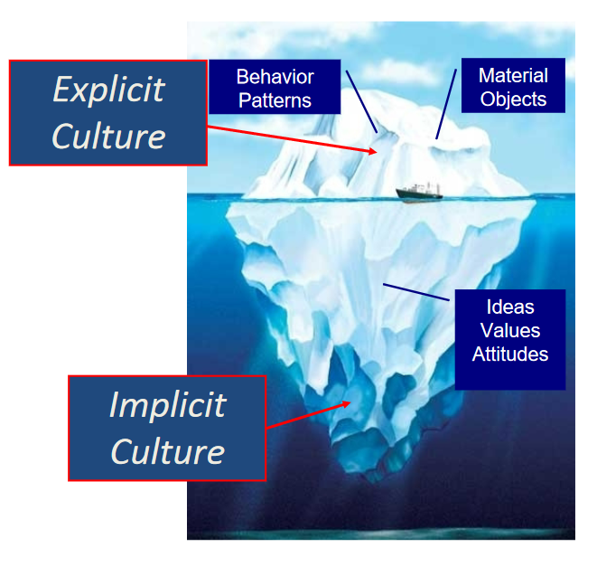

#anthro
## Anthropology
*“To make the strange familiar, and the familiar strange”*
* The study of people *humanity* throughout all times and places
    * investigates biological & cultural complexity, past & present
* Derived from Greek word *anthropos* means "human" & *ology* which is "meaning" or "symbols" or "knowledge of".
* Emerged because we were curious about who we are as a species
* **Bio Cultural Evolution** refers to the impact culture & biology has on evolution
* **Ethnographies** emphasize, among other topics, religion, myth, diet, gender-roles, and child rearing practices
### Culture
* **Culture** is the strategy that humans adapt (socially and biologically) to the natural environment
    * About the beliefs and behaviors that are *learned* and *shared* 
    * Abstracts ideas, values, and perceptions of the world that inform and guide us
    * Reflected in peoples behavior
    * Lens for which we view our world, *"invents"* our reality
* **Ethnocentrism** is one one culture thinks they are better than the rest
### Culture Iceberg

## Disciplines of Anthropology
* In U.S. Anthropology includes 4 main subdisciplines
* Some use the scientific method (Biological Anthro)
* Others use humanistic & interpretive approaches (Cultural Anthro)
### Archaeology (past)
* Focus on material past
    * Tools
    * food
    * pottery
    * art
    * shelter
    * seeds
* **Prehistoric Archaeologists** recover & analyze the materials to rebuild the lifeways of past societies that lacked writing
* **Historical Archaeologists** study recent societies using material remains to compliment the written record
* Questions like
    * How did people in a particular area live?
        * What food did they eat?
        * What happened to them?
    * When and why did humans develop agriculture?
    * How did cities first develop?
    * What type of interactions did these prehistoric people have with their neighbors?
* **Excavation** carefully digging up stuff to reveal and uncover material remains and record them in their context
### Cultural Anthropology (present)
* Focuses on similarities and differences among living societies  
* suspend what you consider "normal" to understand perspective of people the study
* **Cultural Relativism** (cultures have merits within their own historical and environmental contexts)
* Learns perspectives through participant-observation
* Studies all aspects of human life, from religion, to video games
### Biological/Physical Anthropology (origins)
* Study of the human species from biological perspective
* Uses the scientific method to solve the problems
* Some study **hominims** which are modern day humans and human like ancestors
* Humans are different for a wide variety of reasons
    * enviroment
    * diet
    * activities we engage in
    * genetic makeup
* Questions include
    * What is our place in nature? How are we related to other organisms? What makes us unique?
    * What are our origins? What influenced our evolution?
    * How and when did we move/migrate across the globe?
    * How are humans around the world today different from and similar to each other? What influences these patterns of variation? What are the patterns of our recent evolution and how do we continue to evolve? 
* Several different subfields
#### Primatology
* Studies anatomy, ecology, & behavior of monkeys, apes, tarsiers, lemurs, & lorises
* non human primates are our closest living relatives
* Gives insights into how evolution has shaped our species & primates in general
#### Paleoanthropology
* Studies human ancestors from the distant past to learn how, why, and where they evolved
* Must rely on physical evidence, no writing available from these peoples
    * Fossilized remain
* An example, Lucy
    * 3.2 million year old fossilized skeleton
    * she was a near hominin species (*Australopithecus afarensis*)
    * **bipedal** walked on two feet, like us humans
    * over 40% complete skeleton
#### Bioarcheology (Osteology) 
* Study human skeletal remains and the soils and materials around them
* Studies bones and burials
    * Can estimate sex, height, and age at which someone died
    * Can gather clues on lifestyle
    * Figure out what people ate from residue of their last meal or shape of their teeth
#### Molecular Anthropology
* Uses molecular techniques to compare ancient and modern populations like examining DNA
* Our genome is roughly 96% to 99% identical with chimpanzees, the 2% - 4% contributes alot
* Many peoples of the world inherited DNA from Neanderthals and Denisovans (a newly discovered species)
#### Forensic Anthropology
* Similar to Bioarchaeology
* Could go to crime scenes to assist in search & recovery of human remains and/or identify trauma like fractures on bones
* Plays critical role in aiding law enforcement
* Considered applied Anthropology
#### Human Biology
* Varied research
* Tends to explore how the human body is impacted by
    * Different environments
    * Cultural influences
    * nutrition
* Studies **Human Variation** or the physiological differences of humans around the world
    * Some people are lactose intolerent while others arent
* Studies **Human Adaptaion** which includes individual physiological responces or genetic advantages populations develop to adapt to extreme environments

### Linguistic Anthropology
* Studies human languages
* The language you speak allows you to think about certain things and not about others. The **Sapir-Whorf Hypothesis**
* Many questions
    * How was the first language formed?
    * How has it evolved?
    * How does language indicate social identity?
    * How does language affect our views on the world?
### Applied Anthropology
* Sometimes considered the 5th subdisipline
* **Participant Observation** fieldwork is where you live with and learn from a culture for a long time to study them
* Practical applications of anthropological theories, methods, & findings to solve real world problems
* Employed outside academic settings, both public and private sectors
    * Buisness or consulting firms
    * advertising
    * city government
    * law enforcement
    * medical field
    * nongovernmental orgs.
    * military
* Spans all of the subdisciplines

## Anthropological Approaches (Perspective)
### 1. Dynamism (Historical)
* How have we changed? Humans change alot to survive
    * Short or long term changes
    * Temporary or permeant
    * Cultural or biological
    * How environment motivated change
* Examples
    * How an isolated society changes due to globalism
    * How a new language forms
    * How climate change influenced agriculture
    * How diseases changed the shape of our bodies

### 2. Comparison
* Compares data to see how humans are similar, different, and how we've changed over time
* Historical Examples
    * How do humans today compare to *Homo Sapiens?*
    * How Egyptian society changed since the building of the great pyramids?
    * How is the English language adapting to new modes of communication like smartphones?
* Sociocultural Examples
    * Comparing roles of men and women in different societies
    * Comparing religious traditions
* Biological Examples
    * Comparing differences between primate species
    * Investigating traits shared by all primates (including humans)
* Don't compare just your own species or society. They span many cultures, species, societies, time & places

### 3. Holism
* Study all of humanity, not just some random part of it, so we can get a better picture of ourselves
* Examples Include
    * Biological Anthropologist studying monkeys to understand more about them from foraging patterns, physical adaptations, interactions with humans etc. we are primates
    * Cultural Anthropologist studying marriages in some village, considering religious rules, gender norms, family rules, etc
* ==Ethnocentrism== The belief that ones own culture is better than others
    * Justified the subjugation by Europeans of Non European societies

### 4. Fieldwork (Descriptive)
* Don't only work in labs, libraries, or offices
* Goes to where data lives
    * Villages
    * Caves
    * Cities
    * Tropical forests
    * Deserts
* Collects data through **Participant Observation** (living with, observing, and learning from the people you're studying)

### 5. Distinguishes between perspective
* *emic (insider)* vs *etic (outsider)*
* Example
    * An Italian coach talks a mile a minute and gets really close to an American coach, the American is uncomfortable

### 6. Semantic or symbolic
* Humans see things and interpret things in terms of symbols and syntax

## Scientific Method
### Steps to follow
1. Observe an issue
2. Ask a question/state the research problem/Develop a hypothesis
3. Test the hypothesis through data collection and analysis
4. Publish your findings
5. If hypothesis is verified, by others (consensus), then it becomes a theory.

### Theory vs Law
* A **theory** summarizes a hypothesis or a group of hypothesis that are supported with repeated testing
    * Valid as long as there's no evidence to dispute it
    * I guess an accepted hypothesis
* A **law** generalizes a body of observations. At the time it's made, no exceptions have been found to a law
    * Describes something, doesn't explain them