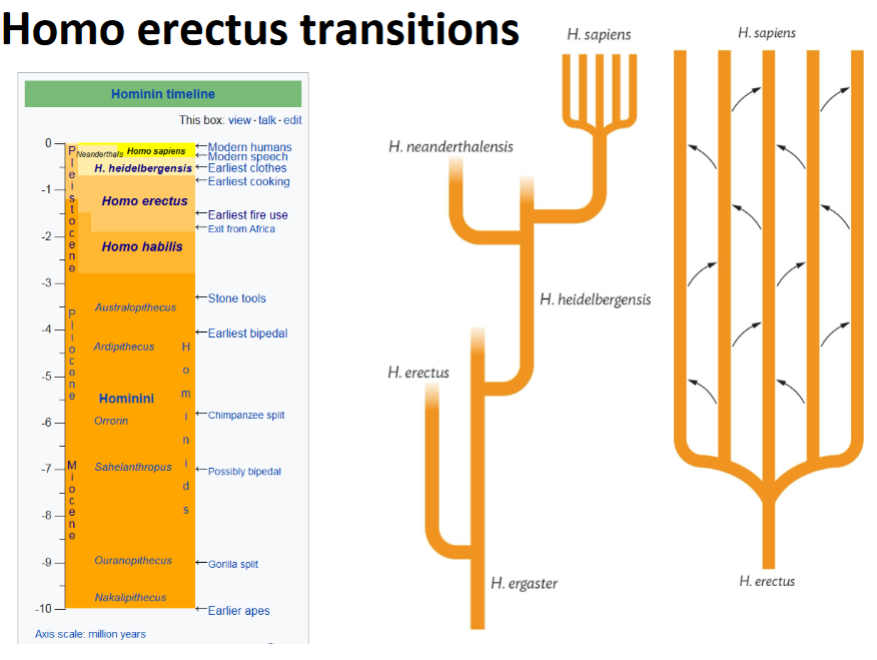

# Tool Industries
## Oldowan
* Oldest, easy to make
* Simple/ few steps
* H. Habilis/ H. Erectus
* Bi-Face, two faces
## Acheulian
* H. Erectus
* Hand axe that looks like a tear drop
* 2mya
## Mousterian
* Much more carefully worked
* Take a rock or core and follow these three steps
	1. Hard hammer percussion, use hammers harder than the stone to strike pieces off
	2. Soft hammer percussion
	3. Even softer percussion for finer work
* When a chuck of rock is struck off, the force makes it ripple from the point of contact
# Pre Modern Humans
Who were these species that came immediately before us?
What were the environmental conditions leading up to our species?
What changes to we see both physiologically and culturally?
What is the timeline?
What happened to them?

### Homo Heidelbergensis
* Mostly ancestor of Neanderthals (Europe)
* Perhaps ancestor of Denisovans (Central Asia)
* First discovered in Heidelberg Germany 1907
* 800k-200k years ago

#### Culture
* Loved in open and natural shelter, like caves
* May have controlled fire
* Varied diet, fruits, veggies, nuts, shellfish, and bird eggs
### Homo Neanderthalensis
(130-30kya)
#### Physical Shape
##### Head
* No forehead, receding forehead
* Larger nose, nasal cavity
* Bigger Jaw
* No chin, sub-ducting chin
* Long low flat brain case
* Large gap behind third molar
* Pronounced supra orbital torus
* Occipital bun
* Massive brain size (1520cc) on average
	* Homo sapiens sapiens brain (1300-1400cc)
* Football shaped head
##### Body
* Large torso
* Short Limbs
* Retained occipital torus
* some mid facial prognathism
#### Regions They Lived
* Europe, Middle east, 

#### Culture
* Clothing and gear
##### Diet
* Meat & Fish with small amount of berries
##### Subsistence Hunter
* Abundance of faunal (large animal) remains
* Large game
* Spear usage
* Tons of injuries in head & neck

##### Stone Tool Industry - Mousterian
* Stone tips were affixed to spears
* More carefully worked than Acheulian tradition
* craftsman used hammers of bone, antler, or similar relatively soft materials for better control in final stages of shaping
###### Levallois Technique 
* Break off little chunks from the core, one at a time
##### Burials
* Drilled shell and pigments
* Rituals
##### Cared for Injured
##### Basic Housing Structure
##### Language?
* Used cave art. Symbolic Expression
* Articulate speech likely, has a highoid, helps speak
* FOXP2 Gene (associated with language) (doesn't work, you cant speak)

#### What Happened?
H. neanderthalensis coexisted with H. sapeins for at least 20k years, maybe 60k years

* May have enveloped genetically with us
* May have been out-competed
* May have been killed by us