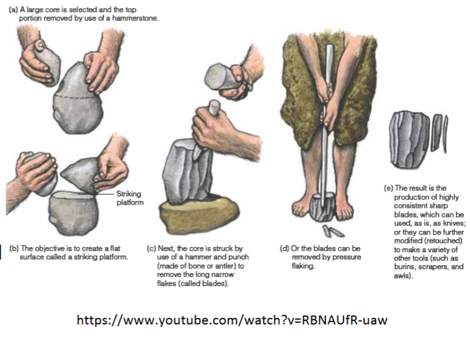
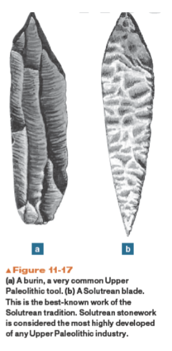
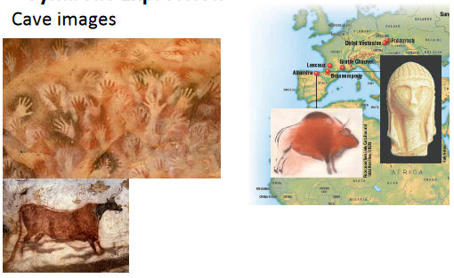
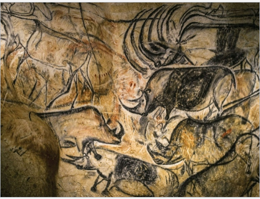

# Homo Sapien Sapiens
### Migration
* Started in Africa 200kyr
* Pushed into Middle East 65-90kyr
* Pushed into East Asia & Australia 50kyr
* Europe 40kyr
* Americas 20+kyr

* Migrated possibly through coasts, not inland

## Theories of Dispersal and Hybridization
3 Distinct Approaches or Models
1. Complete Replacement Model (Out of Africa)
2. Partial Replacement (Assimilation)
3. Regional Continuity

### Complete Replacement Model
* Proposes anatomically modern populations arose in Africa 200kyr
* Migrated from Africa, completely replacing premodern populations in Europe and Asia
* Doesn't account for transition from premodern forms to H. Sapiens anywhere except Africa

### Partial Replacement Model
Various perspectives suggest modern humans originated in Africa. Once population increased, they expanded out of Africa.
* Claims that interbreeding occured between emigrating Africans and resident premodern populations in Europe and Asia

### Regional Continuity Model
* Populations connected by gene flow in Europe, Asia, and Africa continued evolutionary development from archaic H. Sapiens to anatomically modern humans
* Not dogmatic nor dismissive of the evidence that homo sapiens evolved in Africa

### Early Dates
Irhoud 10 (Morocco 300kyr)
* Adult
* Mosaic of modern and pre-modern traits
* Face shape more similar to modern humans
* Braincase matched archaic
* Pointed forms or stone tools

Omo I 195kyr (Southern Ethiopia)
* Adult
* Mosaic of modern and pre-modern traits
* Very large, and extremely long cranial vault

Herto (Ehiopia 154-160kyr)
1. Anatomically and chornologically intermediate
2. May not be distinctive enough to warrant new subspecies name
3. Predictive of changes that would take place
* Long cranial vault, 1450cc
* Heavily built
* Flat face

Skhul\Qafzeh Cave Isreal (100-130kyr), (12-92kyr)
10-20 people

Jinniushan (China 200kyr)
Mix of traits, combination of Homo Erectus and H. Sapiens anatomical features. 1400cc endocranial volume

Blombos cave on Southern Cape 
(70-100kya South Africa)
1. Diverse subsistence strategies (gathers tons of different foods)
2. Multi-step technology and composite tools
3. Occurrence of symbolically mediated behavior (store information on something)
* Oldest settlement (2002)
* Oldest jewelry (2006) (distinguish from someone else, show status)
* More complex tools, composite tools (like a bow an arrow)
	* Spear chuckers, *Atlatl*
* Ocre (Clay, cosmetics)

### Upper PaleoLithic
40-10kyr
Coldest phase of last glacial period, which lasted 26.5-19kyr
Key Features
1. Extinction of Neanderthals
2. Global Migration of Homo Sapiens
3. Behavioral Complexity
	* Symbolic Behavior
		* Cave Art/Petroglyphs/Engravings
	* Settlements 
	* Pre-domestication of crops
	* Innovation/Creativity
		* Diversity in artifacts
#### Technology
* Punch blade tech
* More efficient use of stone
* Bone, ivory and antler become more widely used raw materials

* Over-designed artifacts

*Atlatl* (Spear throwers) - Earliest Projectile Weapon
17.5kyr in france.
Spread like crazy
#### Settlement & Social Stratification
* More investment in grave offerings
* Variable social status reflected in grave offerings?
#### Symbolic Expression
* Cave Images

became common place
#### Culture Recap
Settlements W/Storeage
* Wood, leather working
Tools
* Diversity of types
* Specialization
* Composite Tools
Subsistence
* Gathering rather than hunting became the mainstay of human economics
Domestication of dogs

Art

### Upper Palaeolithic
* Increase in the pace of cultural and technological change

Climate Change
* Glacial Maximum (20kyr) (heating up)
* By 10kyr, change in environment and subsistence
* Climate became predictable
	* Learning how to manipulate sources of food
	* Domesticated crops

Kelp Highway. A sea route along the west coast of the americas