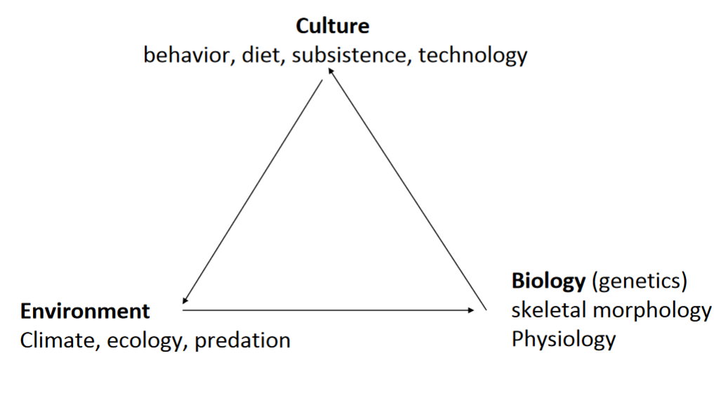

#anthro
# Human Variation
* Caused by *Environmental Stressors*
* *Short Term* vs *Long Term* Adaptations

### Examples
##### High Altitude
*Environmental Stressors*
* Low Oxygen
* Dry/Low humidity
* Wind
* Cold Conditions
* Intense solar radiation
* Reduced Nutritional Variation
* Rough Terrain

*Human Systems Impacted*
* Lungs
* Heart
* Brain

*Short Term*
* Higher Heart Rate
* More breathing
* More red blood cells
* Shortness of breath

*Long Term* 
* Physically grow and mature slower
* Larger heart 
* Larger Lungs
* More Efficient in diffusing $O_2$ from blood to tissue

## Bio-Cultural Evolution
* *Cultural Activities* modify environment
* Evolution can be understood in a cultural context

### Examples
##### Lactose Intolerance
* Inability to digest lactose (produce lactase that breaks down lactose)
* 75% of adults don't produce lactase

*Human Systems Impacted*
* Stomach
* Intestines

*Environmental Stressors*
* Milk Sugar Lactose
* Possibly Lack of Water

* Northern Europe, West Africa, and parts of India/Pakistan keep lactose tolerance.
* Cattle domestication increased, gene arose
* *Convergent evolution*, independent evolution of lactase retention in the two regions

#### Infectious Diseases
* *Vectors*, Agents that transmit disease (usually includes other animals)
* *Zoonotic*, Leap from humans to non-humans and vise versa
* *Pandemic*, Global spread of disease
* *Endemic*, Continuously Present

#### Adaptations to Diseases
##### Sickle Cell Anemia
* Sickle-shaped red blood cells
* Obstruct capillaries, don't roll easily like a regular blood cell
* Carriers still can produce Sickle Cells.

* Sickle Cell's Disallow Malaria parasite to attack your blood

* Agriculture gave proper breeding grounds for mosquitos. Malaria spread soon too

#### Skin Color
* Darker skin means more resistance to sunlight
##### Melanogenesis
* Exposure to UV based on geographical location ancestral populations relative to equator
* UV light is necessary for production of Vitamin D, calcium absorption and bone Mineralization
* New evidence and New ideas
	* Protection from Folate deficiency.
	* *Folate* (folic acid) is essential for embryonic formation of brain and spinal cord
		* Plays role in synthesizing cellular DNA and rapid cell proliferation
		* Folic acid can boost sperm counts in men with fertility problems
		* Sun bathing may be linked to breakdown of folate

##### Race
* Culturally constructed
* Not uniformly agreed upon between countries
* Biologically doesn't exist
* Changes over time and between cultures