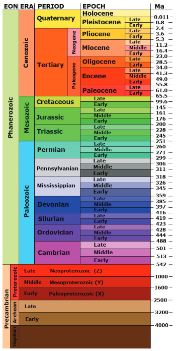

What came first, the Elephant or Wholly Mammoth?
* The Elephant came first

When did dinosaurs become extinct?
* 65 million years ago

How long did upright bipedal primates begin to appear in fossil record?
* 5-7 Million years ago

How long ago did homo sapiens appear
* 200,000 years ago
* 95% of our existence was mobile, hunting, moving around

==Macroevolution==
Focuses on change that occurs at or above the level of species

==Microevolution==
Refers to smaller evolutionary changes

Barriers to gene flow are called ==isolation mechanisms==
* Different groups then can't reproduce with each-other

# Geologic Time Scale
Earth about 4.6 billion years old

Mississippian & Pennsylvanian also known as the 

==Alfred Wegener== in 1912 proposed that continents could move. ==Continental drift==

==Supercontinent Cycle== is the process of continents coming together and splitting apart

### Supercontinents
Kenorland was first supercontinent, 2.7-2.5 bya (billion years ago)
* Wasn't much bigger than Australia today

Nuna / Columbus, 1.8-1.4 bya
* First plant life organisms, red algae

Rodinia, 1.3 bya - 900 mya
* First supercontinent discovered before Pangea

Pannotia, 650-550 mya
* First animals marking ==Cambrian Explosion== around this time showed up

Pangea, 300-66 mya
* Most recent supercontinent

# Species Stuff
==Divergent Evolution==, two or more species diverge from a common ancestor
* Elephant & Wolly Mammoth
* Dog, Wolf, & Fox

==Convergent Evolution==, two or more distinct species share traits NOT due to a common ancestor
* Birds, Bats, Butterflies with wings.

==Homologous Structures==, similar structure, differing function, from a common ancestor
* Arm of a monkey and fin of a narwal
* Wing of a bat and leg of a mouse

==Analogous Structures==, differing structure, similar function, not from a common ancestor
* Wing of a bird vs wing of an insect
* Fin or wing of a penguin and the fin of a shark

==Species==
* Individuals of a species can interbreed
* Offspring can reproduce

==Hybrid==
* Cross Between Species
* Ex: Zonkey, cross between Donkey & Zebra

==Speciation== is development of new species
==Allopatric Speciation==, a geographic barrier separates two populations. Overtime, those two groups become new species
==Sympatric Speciation==, speciation that happens in the same area. Many reasons could block mating between populations
* ==Prezygotic Barriers== are barriers blocking the formation of a fertilized egg or zygote
* ==Postzygotic Barriers== are barriers after the zygote is formed

==Classification== is ordering organisms into categories

Structural similarities shared by a wide range of distantly related species inherited from a remote ancestor are called ==ancestral (primitive)== traits

Traits that reflect specific evolutionary lineages are ==derived (modified)== traits.

Mammals have larger brains than reptiles

==Endothermic== means animals generate their own heat

==Monotremes== are egg laying mammals

### Primates
##### Common Traits/trends
1. Larger brain / Body size
2. Reduced reliance on the sense of smell
3. Greater degree of color vision
4. Bony plate at the back of the eye socket
5. Longer 

8. Most have tails
##### Prosimians (Non-Human Primates)
* Lemurs/Lories/Tarsiers
* Lemurs trapped on Madagascar
1. Greater reliance on **olfaction** (long snouts)
2. Mark territory with **scent**
3. More **laterally** placed eyes
4. **Shorter gestation** and maturation

Primitive traits
1. Ancestral to all primates
2. Located in Africa & Asia
3. Relatively small bodied
4. Loris and Lemurs have a Rhinarium (Wet Nose)
5. Grooming claw (long pointy claws)
6. Dental Comb (long incisors that groom others) (lemurs only)
	* 2-1-3-3 dental  
7. Open Eye Socket
8. Lemurs have Unfused Mandible, jaw in two pieces
	* All other primates have fused jaws
##### New World Monkeys
* In the new world (South America)
* Howler (southern mexico) and spider monkeys
	* Prehensile tail (tail that can grasp)

##### Old World Monkeys
* In the old world (Africa, south asia, east asia)
1. Narrow Nose
2. Tail
3. Most diurnal
4. 2-1-2-3 Dental Formula (same as us)
5. Most quadrupedal and arboreal
* Relatively large, about the size of small to medium-size dogs

###### Baboons
* 5 different species
1. All live in Africa or Arabia
2. Prefer savanna and other semi-arid habitats
3. Primarily Terrestrial Quadrupeds
4. Opportunistic eater and, fond of crops, become destructive pests to many African farmers

1. Terrestrial tend to be **sexually dimorphic** (two shapes between males and females)
2. Cheek Pouches. Expand like hamsters to allow the secure temporary storage of food
3. Omnivorous 
4. Fruit and meat are prized
5. Large male baboons aggressively hunt other monkeys

##### Apes, humans included in this group
* Lesser
	* Siamangs
	* Gibbons
	* Orangutans
		* frugivorous
		* really smart
* Greater
	* Chimpanzees
		* Live in large communities
		* knuckle walking
		* Omnivorous
		* Sexually Dimorphic
	* Bonobos
	* Gorillas
		* Consists of one silverback male
		* Knuckle walk, move on knuckles
		* Vegetarian
		* Calm until threatened

gibbons and orangutans, (south east Asia)
###### Great Apes
chimpanzees and gorillas (west Africa, central Africa)
* Two flavors of chimps, the violent ones, bonobos
1. Larger body size
2. Absence of tail
3. Shortened trunk
4. More complex behavior
5. More complex brain
6. Increased period of infant development
#### Features
1. Arboreal (traverse the rainforest)
2. Color vision (needed to eat ripe fruits & flowers)
3. Finger nails & finger pads with ridges (useful for gripping, feels texture, sensory)
4. Grasping Hands
5. Binocular Vision (two lenses overlap to give zoom, depth perception)
6. Generalized Dentition (can eat just about anything) 
7. More often Diurnal (trend) (We live in the daytime)
8. Increasing Brain Size (trend)

##### Dental Formula
2-1-2-3 dental formula for humans. Formula for one side of the mouth
* 2 incisors at the front (slicing) (born with)
* 1 canine after a little left (tearing meet) (born with)
* 2 premolars more inside the mouth (grinding) (born with)
* 3 molars in the back of the mouth (grinding / crushing) (these grow in)

Different species have different teeth formula
New world monkeys have a different formula

#### Main Difference from other Mammals
1. High degree of parental care
2. Long childhood (brains get bigger)
3. Teach and learn
4. Social Bonds/Long term Relationships
5. Social Hierarchy (we like attention)
6. Range of emotion