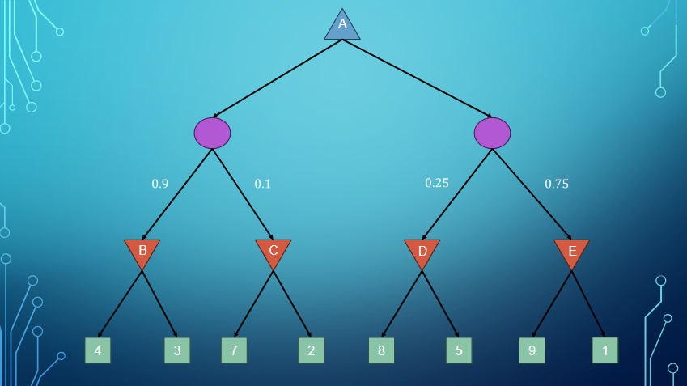

==Adversarial Search In Games== Arise from competitive, multi-agent environments
Three Stances
1. With very large number of agents, consider them in the aggregate as an economy
2. Consider adversarial agents as just a part of the environment, making it nondeterministic
	* Problem, doesn't model agents as fighting against us 
3. Explicitly model the adversarial agents

# Assumptions
1. Deterministic
2. Two-Players or More
	* If two players only, call MAX and MIN, MAX Moves first
3. Turn-Taking
4. Perfect Information 
5. Zero-Sum

# Terms
==Move== is an action
==Position== is a synonym for state
==Perfect Information== is a synonym for fully observable system
==Zero-Sum== means there is no "win-win". What's good for one player is bad for another. Scores can add up to zero
==Terminal Test== is the same as goal testing
==Terminal State== or ==Terminal Position== is the goal state, or the position where the game ends

# Formalization
$s_0$ is the **initial state**
$\text{TO-MOVE}(s)$: the player whose turn it is to move in position $s$
$\text{ACTIONS}(s)$: the set of legal moves in position $s$
$\text{RESULT}(s)$: the **transition model**, which defines the position resulting from taking action $a$ in position $s$
$\text{IS-TERMINAL}(s)$: a **terminal test** which is true when the game is over and false otherwise
$\text{UTILITY}(s, p)$: a **utility** function which defines the final numeric value to player $p$ when the game ends in position $s$

# Game Tree
==Full Game Tree== shows all the positions and all of the moves of the game.

==Move requires all players to take a turn==
==Ply== refers to the turn each agent takes

MAX's positions are the blue triangles
MIN's positions are the red triangles
TERMINAL Positions are the green triangles
### MAX's Strategy
MAX wants a sequence of actions leading to a win
MIN opposes that
MAX needs a **conditional plan** or **policy**
(remember AND-OR search)
# Minimax Search
## Minimax Values
Given a game tree, the optimal strategy can be determined by working out the ==minimax value== of each position in the tree
The minimax value is the utility (for MAX) of being in that position, ==assume both players are playing optimally==
* Minimax value for terminal position is just it's utility
* For non-terminal positions, MAX prefers to move to a state of maximum value, while MIN prefers a state with minimum value

Let's see the tree with some labels and values

The Terminal values have only the utility of that move

Since MIN Plays optimally, the minimax values for MIN's ply are in red next to its positions in the tree
MAX then picks the highest value calculated
## Minimax Search Definition
performs a complete depth-first exploration of the game tree
### Efficiency
Exponential complexity makes it impractical for complex games
Still useful as a basis for mathematical analysis of games
Serves as a starting point for more practical algorithms

### Implementation

MAX-VALUE or MIN-VALUE are very similar
Player is constant

## Minimax With Many Players
Lets have 3+ players. Each node has a vector of minimax values
* Example, in 3 player game with players A, B, C, each node has vector $(V_A, V_B, V_C)$
For terminal positions, vector contains utility values from each player's perspective
For non-terminal positions, the value of a node $n$ is the utility vector of the successor state with the highest minimax value for the player choosing at $n$

The minimax values for players A, B, C are in that order. A goes first, then B, then C
The bottom are the terminal positions
The other positions have the minimax values for each player
==Agents only care about their own score==
Minimax values computed from the bottom to the top of the tree

# Alpha-Beta Pruning
\# of game states is exponential in the depth of the game tree, we can't get rid of that completely
it's possible to cut the search down by ignoring unnecessary game states
called **Alpha-Beta Pruning**

### General Case Of Alpha Beta Pruning
* MAX's perspective
Consider a node $n$ somewhere in the tree such that the player has a choice of moving to $n$
If the player has a better choice either at the same level (node $m'$) or at any point higher in the tree (node $m$), then the player will **Never** move to $n$

### Details
Need to extra parameters with minimax called $\alpha$ and $\beta$
$\alpha$ = MAX's best option so far on path to root (at least)
$\beta$ = MIN's best option so far on path to root (at most)
* Update $\alpha$ and $\beta$ as we search
* Prune the branches at a node once its values is known to be worse than the current $\alpha$ and $\beta$
* initialize $\alpha = -\infty$ & $\beta = \infty$

### Cases Where Pruning Applies

here, one of min's options in the second branch is 2, which is worse than max's best option in the first branch.
Max doesn't need to consider any other options in that branch.

### Efficiency
Depends on the order in which moves are examined
If somehow perfect move order is used, can reduce states from $b^m$ to $b^{\frac{m}{2}}$
In general, there are two categories of strategies that can be employed
1. **Type A**: Consider all possible moves to a certain depth, then use a heuristic function to estimate the utility (wide but shallow)
	* Thrashing is when agent bounces between the same to states over and over, if this is the case, increase depth limit
2. **Type B**: Ignore moves that look bad and follow promising moves as far as possible (deep but narrow)

#### Type A, Heuristic Alpha-Beta Search
Cut off the search early by applying heuristic function $\text{EVAL}$ to the positions
$d$ is for the depth
Replace the $\text{IS-TERMINAL}(s,d)$ with $\text{IS-CUTOFF}(s,d)$

##### Eval Functions
For terminal states, $\text{EVAL}(s, p) = \text{UTILITY}(s, p)$
For non-terminal states,
$$ \text{UTILITY}(loss, p) \le \text{EVAL}(s, p) \le \text{UTILITY}(win, p)$$
Find the different features of a position, determine the amount of contribution each feature provides, and then combine them to create an estimate
**Assumes the features are independent of each-other**
Called a **weighted linear function**
$$ \text{EVAL}(s, p) = w_1f_1(s) + w_2f_2(s) + ... + w_nf_n(s) $$
##### Weaknesses
Two major ones,
* Games with high branching factors
* Dependent on the heuristic function
* GO has high branching factor and no good heuristic function
#### Move Ordering Strategies
1. **Random move ordering**, $b^{3m/4}$ on average
2. **Dynamic move ordering** with iterative deepening
	* Changes move order to hopefully improve pruning
3. **Transposition tables** (lookup table) to account for redundant paths/repeat states

### Implementation

# Monte Carlo Tree Search
Improves on heuristic alpha beta pruning by not using a heuristic
Value of state $s$ is estimated as the average utility over multiple simulations of complete games starting from $s$
A simulation (also called **playout** or **rollout**) continuously chooses moves for the players until a terminal position is reached

## Playout Policy
Decides which moves to choose while simulating the game
Easy Idea: Choose randomly (not good for Monte Carlo)
* Problem: Answers the question "what is the best move if both players play randomly?"
Better Idea: bias good moves
* Could be designed by humans or learned through ML techniques

## Pure MCTS
Do $n$ simulations for each child of the current position
Record fraction of wins
Pick the move that gives the best outcome

## Selection Policy MCTS (Importance Sampling)
Selectively focuses the computational resources on important parts of game tree
Balances two factors:
* **Exploitation** of positions that have done well in past playouts
* **Exploration** of positions that have had few playouts

### UCT Selection Policy
One (very effective) selection policy is "upper confidence bounds applied to trees"
Ranks each possible move based on an upper confidence bound formula called **UCB1**
$$UCB1(n) = \text{Exploitation} + C * \text{Exploration} $$
$$ UCB1(n) = \frac{U(n)}{N(n)} + C * \sqrt{\frac{log(N(PARENT(n))}{N(n)}} $$
* $U(n)$ is the total utility of all playouts that went through **node** $n$
* $N(n)$ is the number of playouts through node $n$
* $Parent(n)$ is the parent node of $n$ in the tree
* $C$ is a constant that balances exploitation and exploration
	* Start this at $\sqrt{2}$ and then adjust for the specific game
### Implementation

PICK THE NODE WITH HIGHEST NUM OF PLAYOUTS!!!

### Implementation Drawn Out
#### Selection
Start at root of tree
Choose move guided by selection policy
Generate successor node
Repeat until leaf

##### Example Selection
The selection policy is the node with the highest win-rate

#### Expansion
Grow the tree by generating a new child of the selected node
Mark child playout record as 0/0

##### Example Expansion

#### Simulation
Perform a playout for that newly generated child node
Choose moves according to the playout policy
Update the count for this node
* 1/1 if player one
* 0/1 if player lost
* 0.5/1 if a draw

##### Example Simulation

#### Back Propagation
Use result of simulation to update all nodes in the path back to the root
Denominator for all nodes increases by 1
Numerator increases by 1 only if the player at the node won the simulated playout

##### Example Back Propagation

### Cool Monte Carlo Tree Search Visualizer
[here](https://vgarciasc.github.io/mcts-viz/)

# Expectimax
## Expextimax Value
Lets now assume we are looking at the average case of a set of events
In **stochastic games**, there is an element of randomness (probabilities) involved
Values should reflect average case outcomes instead of worst case outcomes
* Computes the average score under optimal place
* Instead of MAX & MIN, we have MAX & CHANCE, b/c the outcome is uncertain
* Need to calculate expected utility (weighted average or mean)

$P(r)$ stands for the probability of r

The Expectimax value of the left is $0.4 * 10 + 0.6 * 8 = 8.8$
The right value is $0.7 * 9 + 0.3 * 100 = 36.3$

## Assumptions Vs Reality Example

# Expectiminimax Search
In a stochastic game, treat the environment as an extra "random agent" player that moves after MAX/MIN
Must incorporate chance node in addition to MAX and MIN nodes
Computes the average score under optimal play for both players

Min works like normal. The chance nodes then have 3, 2 for the left side 5, 1 for the right as the values it looks at
Expected value for the left is 2.9, expected value for the right is 2, so always pick left

### Efficiency
We can still do previous improvements to Expectiminimax
* Alpha-Beta pruning
* Heuristic eval functions
* Monte Carlo tree search