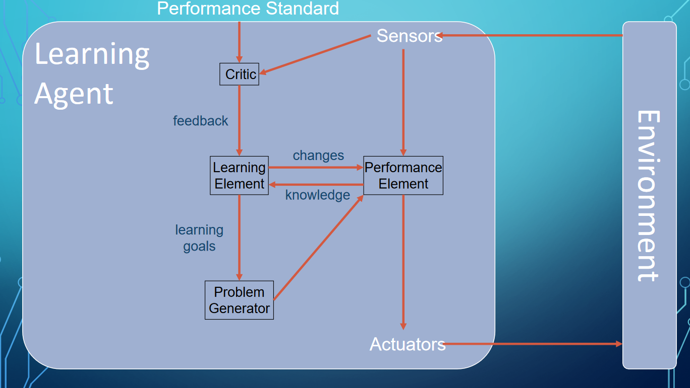

#AI

# What is Artificial Intelligence?
* What can AI do?
    * What should we worry about?
    * What can we do about these things?
    * What should we not worry about? 

## Federal Governments Definition of (AI)

* Machine learning isn't the only thing that's cool about AI

## AI Spectrum

## Rationality
* Maximally achieving predifined goals
* Only concerns what decisions are made
    * Not the thought processes behind them
* Goals expressed in terms of **utility** of outcomes
* Being rational = maximizing **utility**

## The Standard Model
* AI has focused on the study and creation of agents to do the right thing
* What counts as the right thing is defined as the objective that we provide to the agent
* **Perfect Rationality** vs. **Limited Rationality**
    * Perfect Rationality means given enough time it will always pick the best choice to get to its goal (not likely)
    * Limited Rationality means it doesn't have enough time to determine the best choice
* The AI will do whatever to achieve the goal (even if the action is pretty dangerous)

## Beneficial Machines
* Standard model is useful, but not always the best
    * Assumes we supply a fully supplied objective to the agent
* **Value Assignment Problem**: The values or objectives put into the machine must be aligned with those of the human  
* We do not want machines that are intelligent in the sense of pursuing *their* objectives, we want them to pursuing *our* objectives
* New Model: build agents that strive to achieve human objectives but know that they don't know for certain exactly what those objectives are 

# History of AI
* 1940-1950: Early Days
    * 1943: McCulloch & Pitts created a Boolean circuit model of the brain
    * 1950: Turing publishes his "Computing Machinery and Intelligence" paper
* 1950-1970: Exciting Developments
    * 1950s: Early AI programs
        * Samuels **Checkers Program**
        * Newell & Simon's **Logic Theorist**
        * Gelernter's **Geometry Engine**
    * 1956: summer workshop at Dartmouth College
        * Considered to be the founding event of "artificial intelligence" as a field
    * 1965: Robinson's complete algorithm for logical reasoning, Lisp programming language inspired from this workshop
* 1970-1990: Knowledge & Winter
    * 1969-1979: Early Development of knowledge-based systems
    * 1980-1988: **Expert systems** industry booms
    * 1988-1993: **Expert systems** industry busts, beginning of "AI winter"
* 1990-???: Statistical Approaches
    * Resurgance of probability, focus on uncertainty
    * General increase in techincal depth
    * Agents and learning systems
    * 1996: Kasparov defeats Deep Blue at chess
    * 1997: Deep Blue defeats Kasparov at chess
* 2000-???: Modern Period
    * Big data, big compute, deep neural networks
    * Proliferation of AI in many industries
    * 2011: IBM's Watson defeats Jennings and Rutter at Jeopardy!
    * 2014: The beginnings of Generative AI
    * 2016: Googles AlphaGo defeats Sedol at GO
    * 2021: Release of DALL-E
    * 2023: Release of GHAT-GPT

# Agent Structure
* An **Agent** is an entity that percieves and acts
* A **Rational Agent** selects actions that maximize its (expected) utility
    * "Doing the right thing"
* Characteristics of the **percepts** (inputs), **environment**, and the **action space** dictate techniques for selecting **rational** actions
* An agents behavior is described by the **Agent Function** that maps any given precept sequence to an action

## How to specify the task the Agent performs (PEAS)
* Performance measure
	* Describes the **utility** our Agent is trying to maximize
* Environment
	* Summarizes where the Agent acts and what affects the Agent
	* Either the real world or the digital world
* Actuators
	* Method with which the Agent acts on the environment
* Sensors
	* Method with which the Agent receives information from the environment

## Simple Reflex Agent
* Chooses actions only on the current percept
* Doesn't consider the future consequences of its actions

## Model-Based Reflex Agent
* Chooses actions based on the current precept and an internal state to keep track of the environment based on percept history

## Goal-Based (Planning) Agent
* Makes decisions based on (hypothesized) consequences of actions
* Needs a model of how the world evolves in responce to actions
* Must formulate a goal (pick this carefully)

## Utility-Based Agents
* Makes secisions based on the (expected) utility of choosing an action based on its knowledge
* More flexible than goal-based agents (e.g., conflicting goals, uncertainty)

## Learning Agent
* Uses past experiences to learn and modify it's behavior to increase it's performance
* Allows agent to operate in unknown environments and become more competent over time

* Think of the Performance Element as any of the other Agents
* The critic uses a set standard to tell the bot where to improve
* The learning element is whatever learning model you use
* The problem generator can give new random actions to take, potentially making a better path

## Environment Types
* The **design** of the agent heavily depends on the type of environment the agent acts upon

| Fully Observeable | Partially Observable |
| :--: | :--: |
| Agent has full information about their state | Does not have full information |
| | Must have an internal estimate of the state of the world |

| Single-Agent | Multi-Agent |
| :--: | :--: |
| Agent is acting alone in environment | agent is acting in an environment with multiple other agents

| Deterministic | Stochastic |  Non-deterministic |
| :--: | :--: | :--: |
| Current state + Agent Action = Next State | Current state + Agent Action + probabilities = Next State | Current state + Agent Action + ??? = Next State |

| Episodic | Sequential |
| :--: | :--: |
| Agent's experience is dividied into atomic episodes, Episode = Precept + Action | The current decision could affect all future desicions |
| Next episode doesn't depend on actions taken in previous episode | |

| Static | Dynamic |
| :--: | :--: |
| Environment does not change as the agent considers what action to take | Environment can change as the agent is deliberating |

| Discrete | Continuous |
| :--: | :--: |
| Environment, time, precepts, actions are enumerable (countable), can list all posibilities | Environment, time, precepts, actions are uncountable | 

| Known | Unknown |
| :--: | :--: |
| Outcomes (or outcome probabilities) for all actions are given | Outcomes are missing |
