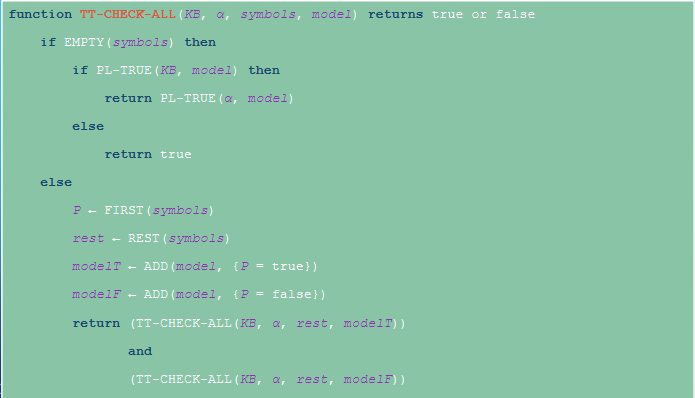

#AI
# Knowledge
Agents acquire knowledge through perceptions, learning, language
* Knowledge of the effects of actions (transition model)
* Knowledge of how the world affects sensors (sensor model)
* Knowledge of the current state of the world
Can use knowledge to keep track of a partially observable world
Can formulate plans to achieve goals
## Knowledge-Based Agent
Goal is to gain knowledge
* Combine and recombine information
* Accept new tasks in the form of explicitly described goals
* Achieve competence quickly by being told or learning new knowledge about he environment

The central component of a knowledge-based agent is its **knowledge base** (KB)
* This is a set of sentences expressed in a knowledge representation language
Initialize the KB with **axioms**
* Sentences that are taken as being given without being derived from other sentences
Generated new knowledge through **inference**

### Two Fundamental Pieces
Knowledge Base
Inference Engine

### Implementation

recall back to the beginning of class [[Intelligent Agents]]
(persistent is like static in C++)

## Knowledge Engineering
1. Identify the questions
2. Assemble relevant knowledge
3. Decide on a vocabulary of predicates, functions, and constants
4. Encode general knowledge about the domain
5. Encode a description of the problem instance
6. Pose queries to the inference algorithm and get answers
7. Debug and evaluate the knowledge base

# The Wumpus World
Wumpus world is a cave consisting of rooms connected by passageways
Somewhere in the cave lives the Wumpus
A Wumpus can be shot by the agent, but the agent only has one arrow
Some rooms have bottomless pits
One room has a heap of gold

how does knowledge based agent work in Wumpus world?

# Logic
Logic system must have **syntax** and **semantics**
Syntax tells us how to write a well-formed sentence
Semantics is the meaning behind a sentence
* Defines the truth of each sentence with respect to each possible **world (model)**

## Entailment and Inference
**Logical entailment** is the relation that one sentence $\beta$ follows logically from another sentence $\alpha$
* $\alpha \vDash \beta$
* Every model for $\alpha$ must also be a model for $\beta$
* In every world where $\alpha$ is true, $\beta$ is also true
**Logical inference** is the process of using entailment to derive conclusions
* $KB \vdash \alpha$

## Inference Algorithm Properties
Derives only entailed sentences is called **sound** (only keeps truth) (required)
**Complete** if it can derive any sentence that is entailed (all knowledge will be found) (nice to have)
**Grounding** is the connection between logical reasoning and the real world (required)

## Propositional Logic
Simple logic system
Need to define the syntax and semantics for this system
Need to write a lot to say a little
### Syntax

### Semantics

## Model Checking
One inference alg we can use is **model-checking**
* Enumerate all possible models
* Check that $\alpha$ is true in every model in which $KB$ is true
* If so, we can claim $KB \vdash \alpha$
$\text{TT-ENTAILS}$ implements this idea
* This alg is both sound and complete
* However, it checks an exponential number of models

### Implementation

Entailment is basically implication. So if P is false, then return true

## Theorem Proving
applies rules of inference directly to the sentences in $KB$ to construct a proof without consulting models

### Propositional Theorem Proving
iff means if and only if
Two sentences $\alpha$ & $\beta$ are **logically equivalent** iff they are true in the same set of models
* $\alpha \equiv \beta$ iff $\alpha \vDash \beta \land \beta \vDash \alpha$
**Tautology** are valid sentences that are true in all models
==Deduction Theorem==: for any sentence $\alpha$ and $\beta$, $\alpha \vDash \beta$ iff $\alpha \Rightarrow \beta$ is valid (a tautology)
A sentence is **satisfiable** if its true in SOME model
* The SAT problem is very hard (np complete)
* $\alpha \vDash \beta$ iff $\alpha \land \lnot \beta$ is unsatisfiable

| Three Definitions Of Entailment | $KB \vDash \alpha$ |
| :--: | :--: |
| 1 | for every model where KB is true, show that $\alpha$ is also true |
| 2 | $KB \Rightarrow \alpha$ is a tautology/valid |
| 3 | $KB \land \lnot \alpha$ is unsatisfiable (a contradiction) |

### Inference Rules
**Inference rules** can be applied to derive a *proof*
* A chain of conclusions that leads to desired goal
Search algorithms can be used to find a proof
* Initial state: the KB
* Actions: the inference rules
* Result: add the concluding sentence from the inference rule to the KB
* Goal Test: a state that contains the sentence we are trying to prove

### Conjunctive Normal Form
Every sentence in propositional logic is logically equivalent to a conjunction of clause
Called **Conjunctive normal form** or **CNF** (no implications or bi-implications) (Ands on the outside, Ors on the inside)

### PL-Resolution

Uses third definition of entailment to try and find $KB \land \lnot \alpha$.

### SAT Solvers
Very important
* Circuit verification: Does this VLSI circuit compute the right answer?
* Software verification: does this program compute the right answer?
* Software synthesis: what program computes the right answer?
* Protocol verification: can this security protocol be broken?
* Protocol synthesis: what protocol is secure for this task?
* Planning: how can I accomplish my goal?

#### DPLL and WalkSAT
Modern SAT solvers rely on some variation of DPLL alg from 1962
* Davis-Putnam-Logemann-Loveland
* Recursive depth-forst enumeration of models with some improvements
Can use a local search approach too called WalkSAT alg
* Useful when we ==expect a solution to exist== (BIG ASSUMPTION)
* It can't always detect unsatisfiability, so no proof guarantee, but good estimate

if we don't find a satisfied clause, flip a coin.
If heads, flip the value in the model of a randomly selected clause, and try again
If tails, flop whichever symbol in clause maximizes the number of satisfied clauses

## First Order Logic (predicate calculus)
An improvement for propositional logic
* Uses objects and relations
* Expresses facts about some or all of the object
### Syntax

* Has a **predicate**, a property of an object or a relationship between objects (bool function)
* A **term** is an object that exhibits some given predicate
* A **quantifier** indicates how frequently a statement is true

#### Examples
All (quantifier) cats (term) have tails (predicate)
$\forall c \text{ HasTail(c)}$

Merlin (term) is a cat (predicate)
$\text{Cat(Merlin)}$

Claudio (term) and Alvin (term) are brothers (predicate)
$\text{Brothers(Claudio, Alvin)}$

### Semantics
* Previous logical connective from Propositional Logic are the same
* Equality symbol = signifies that two terms refer to the same object
* Universal quantifier $\forall$ asserts sentence is true for all terms
* Existential quantifier $\exists$ asserts that the sentence is true for at least one term

#### Examples
"All ducks are awesome"
$\forall d \text{ Awesome(d)}$ (assumes we are only talking about ducks and nothing else)
$\forall x \text{ Duck(x)} \Rightarrow \text{Awesome(x)}$

"Some people are vegan"
$\exists p \text{ Vegan(p)}$ (assumes we are only talking about people)
$\exists x \text{ Person(x)} \land \text{Vegan(x)}$

"For any two even numbers, there sum is also even"
$\forall x \forall y (\text{Even(x)} \land \text{Even(y)}) \Rightarrow (\exists z \text{ IsSum(x, y, z)} \land \text{Even(z)})$

How to say nothing.
"Nobody is perfect"
$\forall p \text{ } \lnot \text{Perfect(p)}$ (assuming p is only people)
$\lnot(\exists p \text{ Perfect(p)})$

How to say exactly one.
"I have only one sister"
$\exists p \text{ Sister(Josiah, p)} \land \forall o \text{ Sister(Josiah, o)} \Rightarrow o = p$