#AI 
### Rationality In Uncertain World
* Relative importance of various goals
* Likelihood that they will be achieved

### Propositional Logic & First Order Logic Fails for certain domains
* Laziness: too much work to list all parts
* Theoretical ignorance: no complete theory of the domain
* Practical ignorance: uncertainty due to lack of data

# Probabilities & Utilities
* Answers Rationality
==Probability theory==, gives way of summarizing uncertainty coming from laziness & ignorance
Agents need ==Preferences== from different outcomes
==Utility Theory== to rep. preferences

## Decision Theory
= Probability theory + Utility Theory
==Principle of maximum expected utility== (MEU)
* Agent is rational iff chooses actions yielding highest expected utility, averaged over all possible outcomes of action
$$a^* = argmax_a\sum_{}{}$$
# Probability
Refer to [[Basic Probability]]

==Sample space== $\Omega$ or S, collection of all outcomes
==Event== is particular possibility in $\Omega$
==Probability== is measure of likelihood that event occurs in given sample space
$$P(A) = \frac{|A|}{|\Omega|}$$
##### Machine Learning Teaser
==Prior probability (priors)== is prob. in absence of other info (independent events)
==Posterior probability== is prob. given other info (conditional probability)

### Probability Distribution
==Joint Distribution== is $P(T \lor W)$ where $T$ & $W$ are variables (this is xor)
==Marginal Distribution== is $P(T)$ & $P(W)$ from $P(T \lor W)$. Can remove one var
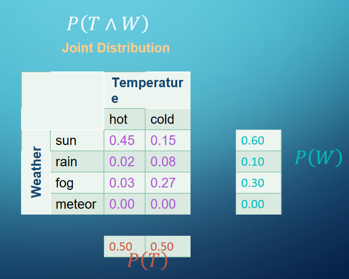
==Conditional Distribution== is $P(W | T)$
* We need a normalizing constant $\alpha = \frac{1}{P(T)}$
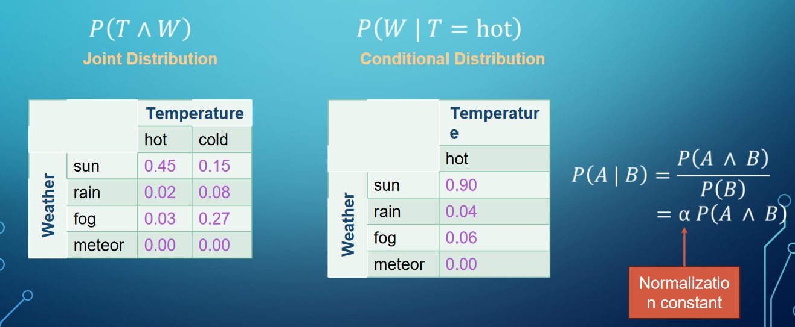

### Probabilistic Inference
* Computation of posterior probabilities for query propositions given observed evidence
Possible Approach, Enumeration:
* Use full joint distribution as "Knowledge base"
Problem: Sample space gets thicc
* Sample space with $n$ random variables and $d$ range of values, table has $d^n$ entries, requires $d^n$ time to process

### Enumeration
Prob. Model $P(X_1, X_2, ..., X_n)$
Partition random vars into three categories
* Evidence vars $E$
* Query vars $Q$
* Hidden vars $H$
Goal: calculate $P(Q|E)$
Steps:
1. Select entries consistent with evidence
2. Marginalize to sum out H from model to get $P(Q, E)$
3. Normalize to get $P(Q|E) = \alpha P(Q, E)$

## Bayes Theorem
* Most Important Probability Rule in AI 
$$P(B|A) = \frac{P(A|B)*P(B)}{P(A)}$$
$$P(Cause | Effect) = \frac{P(Effect | Cause) * P(Cause)}{P(Effect)}$$
* One of the givens is hard, but it's easy to calculate the flipped one
* this is a form of learning, to go from prior to posterior

### Inference with Bayes Theorem
* Can perform diagnostic probability from causal probability
* Suppose we want to calc. $P(\text{Meningitis | StiffNeck})$
* We know the probability for the other three components
$$P(\text{Meningitis | StiffNeck}) = \frac{P(\text{StiffNeck | Meningitis}) * P(\text{Meningitis})}{P(\text{StiffNeck})}$$
$$ = \frac{0.7 * 0.00002}{0.001} = 0.0014$$
### Conditional Independence
$P(B, C | A) = P(B | A, C) = P(C | A, B)$
* if this equality holds, B & C are conditionally independent *GIVEN A*
#### Combine Bayes Theorem
$P(B, C, A) = \alpha P(B, C | A) * P(A) = \alpha P(B | A) * P(C | A) * P(A)$
* A "Separates" the other variable
* n variables become n terms
* Only works with conditional independence

### Naive Bayes Model
* Assume conditional independence, can create a naive bayes model for our probability distribution
$P(Cause,Effect_1,...,Effect_n) = \alpha P(Cause) * \prod_{i}P(Effect_i | Cause)$
where $\alpha = \frac{1}{\sum_{i}P(cause_i) * \prod_{j}P(effect_j | cause_i)}$
* We can usually disregard this when we are looking for which one event is more likely than an other event

Used widely
* Language determination
* Document retrieval
* Spam filtering
* Classification tasks

## Bayesian Network
### Syntax
* Technique for describing complex joint distributions using simple conditional distributions
* Consists of (a DAG (remember cs20) graph)
	1. Node
		* A random variable in probability distribution
	2. Edge
		* a direct influence between variables
	3. Conditional Probability Table (CPT)
		* Gives probabilities for each node *GIVEN ALL PARENTS*
		* If no parent, table gives direct probability

#### Examples

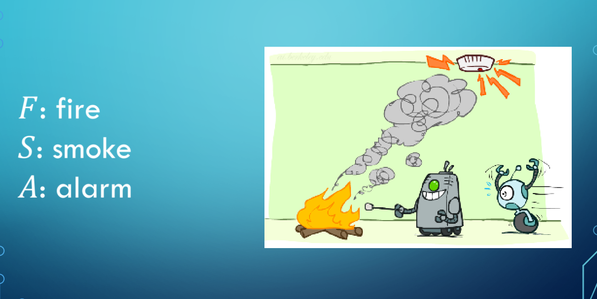
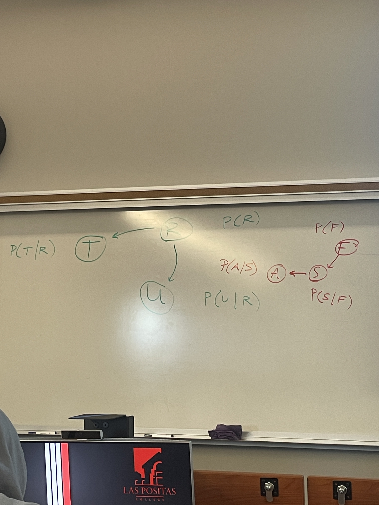
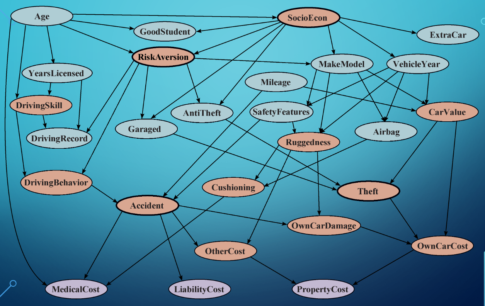
(orange nodes are hidden)
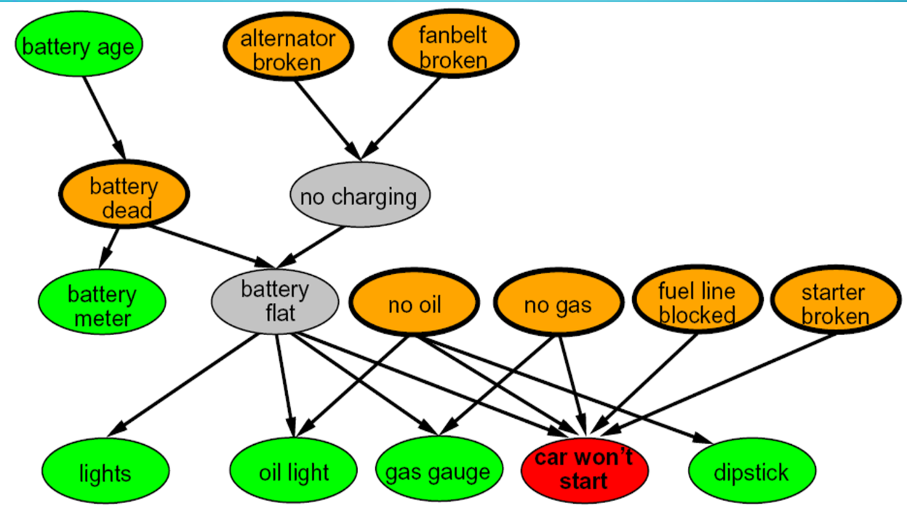
(green nodes are info)
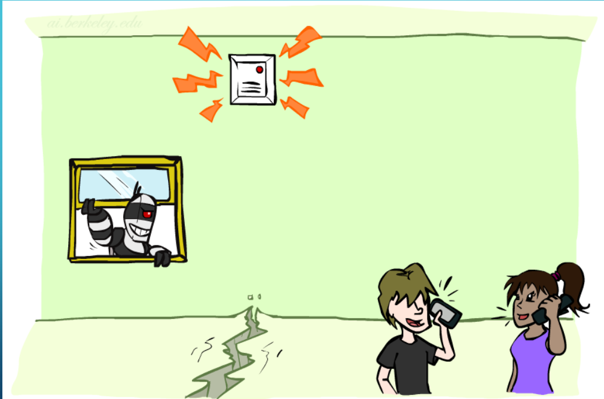
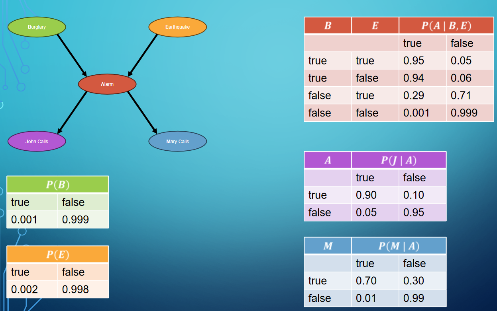
* The blue table should have A instead of M in the first column
* We only need to store the first half of each table. We can $1 - Val$ for the rest of the values.
	* The calculated ones are *Free Parameters*

### Semantics
* Bayes nets encode joint distributions as products of conditional distributions on each var.
$$P(X_1, ..., X_n) = \prod_{i}P(X_i|Parents(X_i))$$
With the robber, earthquake, alarm example
$$P(r, \lnot e,a, \lnot j, \lnot m)$$ $$= P(r) * P(\lnot e) * P(a | r, \lnot e) *  P(\lnot j | a) * P(\lnot m | a)$$
$$=(0.001)(0.998)(0.94)(0.1)(0.3) = 0.00000281436$$

#### Node Ordering
* Order in which nodes are chosen affects Bayes net & how well it encodes full joint distribution
* General rule: stick to a *causal model* (cause then effect) when constructing bayes nets

### Exact Inference By Enumeration
* Inference in Bayesian networks can be done by marginalizing entries from joint distribution
$$P(Q | e) = \sum_{h}P(Q,h,e)$$

From robber earthquake alarm example

Question:
What is the probability of a robbery given that John & Mary called
Variables to consider are e & a
$$P(B | j, m) = \alpha \sum_{e, a} P(B,e,a,j,m)$$
$$ = \alpha \sum_{e,a} P(B) * P(e) * P(a | B, e) * P(j | a) * (m | a) $$
(consider all possibilities for e and a to eliminate them out, this formula arises)

we can optimize this away, there are repeats

### Variable Elimination Algorithm (VEA)
* Can optimize exact inference
1. Move summations as inward as possible
2. Compute right to left

From the robber earthquake alarm example (robber is a bergler here)
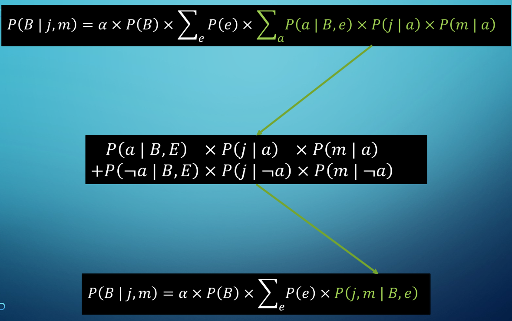
we're not cancelling here, we are doing addition and multiplication to reduce this down

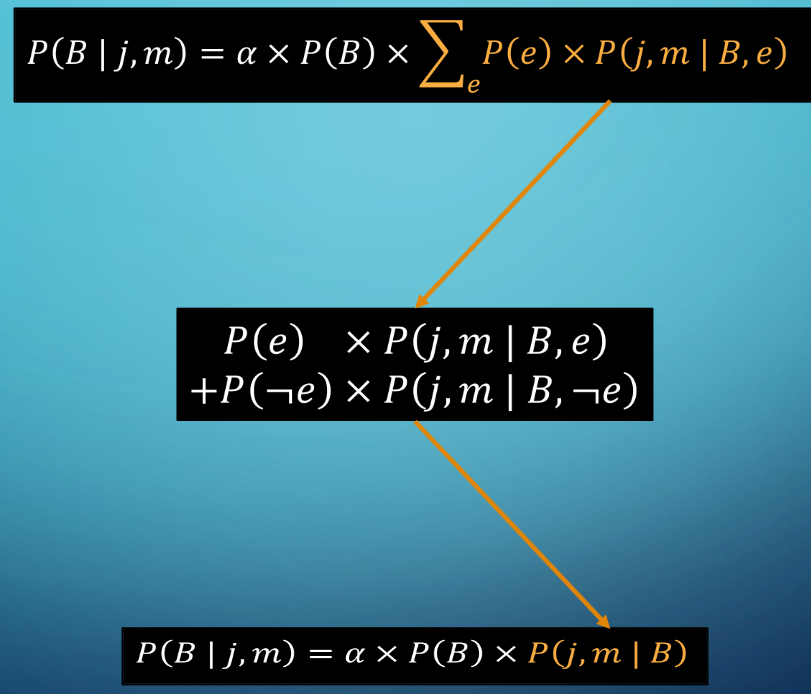
We are doing the addition and multiplication in this step as well, no cancelling here

### Approximate Inference
Basic:
* Draw $n$ samples from a sampling distribution $S$
* Compute an approximate posterior probability
* Given enough time, approx. converges to the true prob. dist. $P$
Sampling is often simple, efficient, and general
* Prior sampling
* Projection sampling
* Likelihood weighting
* Gibbs sampling

#### Summary
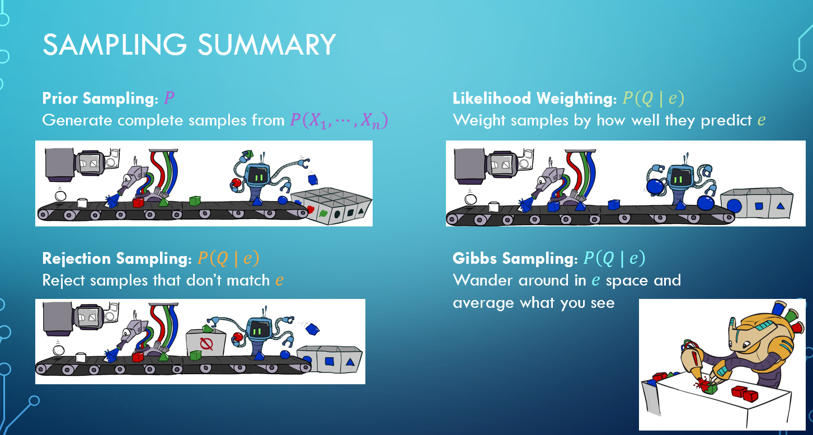
Q is the query, e is the evidence
Gibbs is basically Simulated Annealing + Monte Carlo
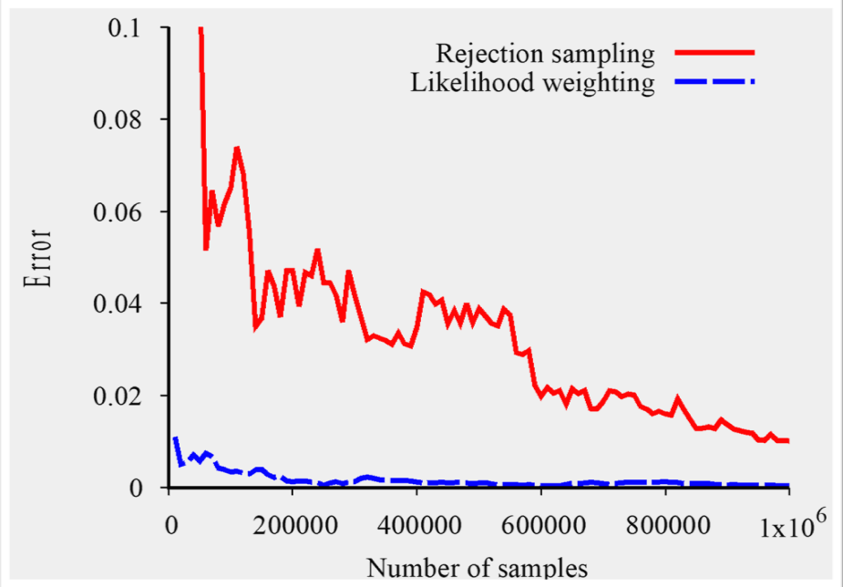
