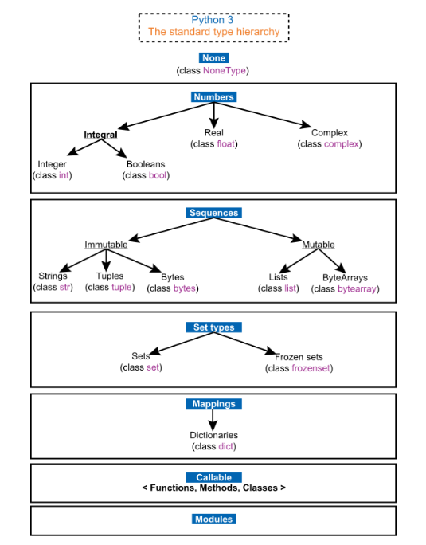
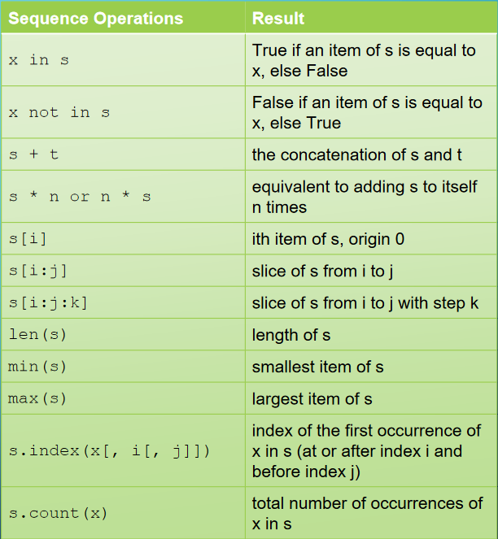
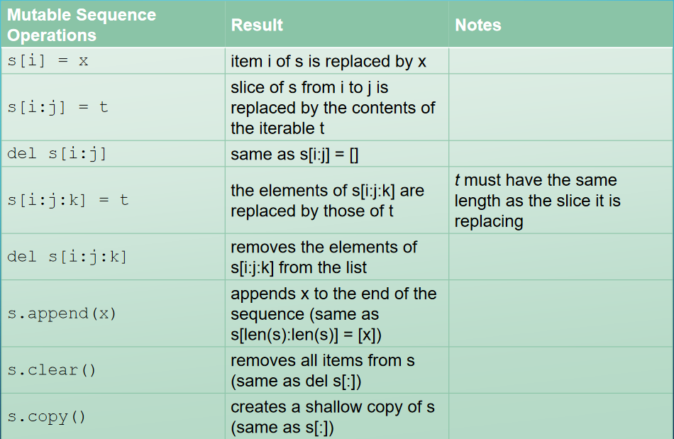
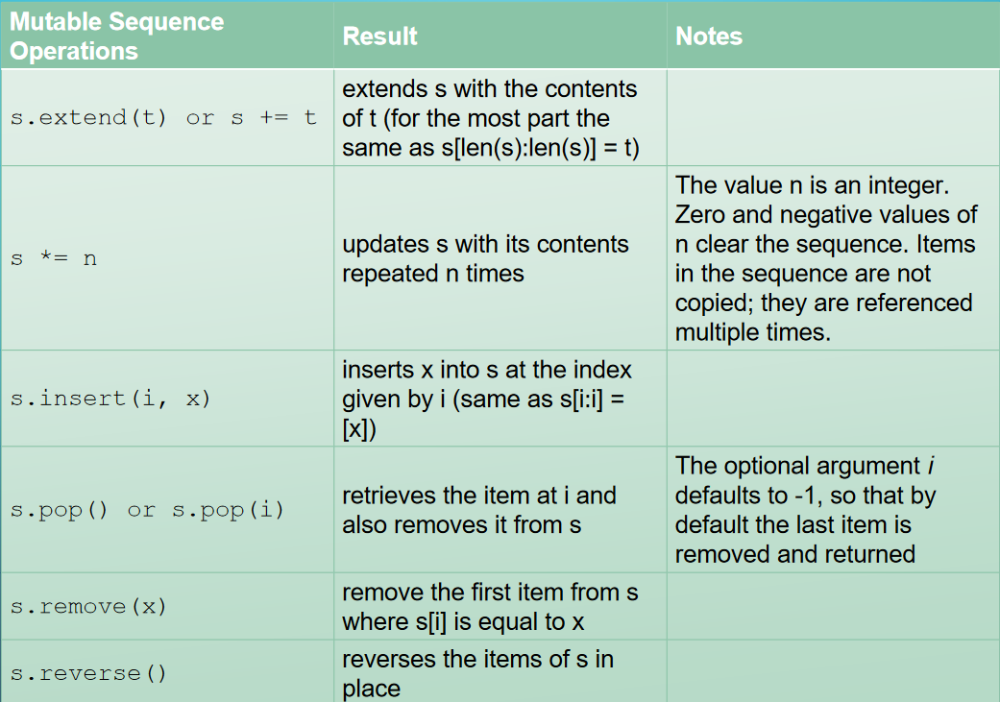
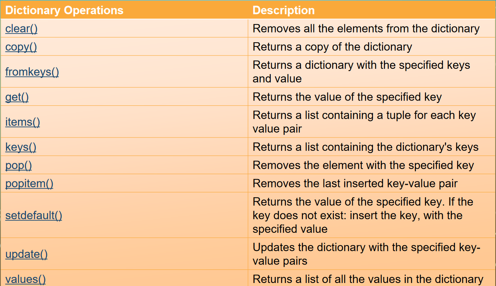
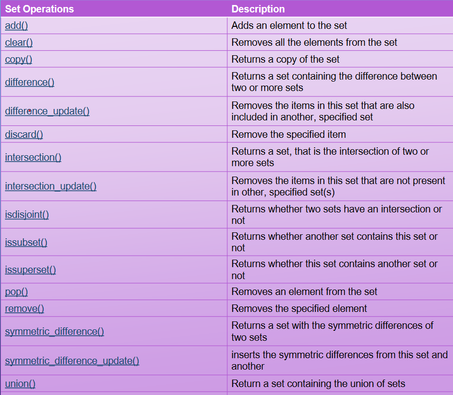

* A High-level, general purpose programming language
* Developed by Guido Van Rossum
* Features
	* Code readability
	* Indentation to denote scope
	* Dynamically typed
	* Garbage Collected
* Comments are text, starts with #

## Data types

## Sequence Functions

### Mutable Sequence Functions

## Dictionaries
* Stores key value pairs
* Keys must be **immutable** and **unique**

## Sets
* Items aren't in particular order
* **Unique** values in set

## Important Note
* **Python Functions use pass by reference**
## Jupyter Notebook
* Popular, interactive, web based framework
* Combines computer code, language or text, data, rich visualizations like 3D models, charts, graphs & figures, & interactive controls
## Python Tutor
* useful for debugging
[Python Tutor](https://pythontutor.com/render.html#mode=edit)
