#AI
# Formulating a Well Defined Problem
* A ==well-defined problem== consists of at least 4 things
    * a state space
    * transition model
    * actions and their costs
    * a goal test

## States
* The ==world state== includes *every detail* of the environment of the current percept (input)
* A ==search state== keeps only the details needed for planning
    * This is a type of abstraction
* The ==initial state== is the state the agent starts in
* A ==goal state== is a state the agent wants to reach

## Actions
* A well-defined problem should have a way to generate the possible actions available to an agent
* ACTIONS($s$) -> Set(State)
    * Given a state $s$, return a finite set of actions that can be executed in $s$
* ACTION-COST($s$, $a$, $s'$) -> u32
    * An ==action cost function== is a way to assign a numeric value when performing an action $a$ in state $s$ to reach state $s'$
    * This fuctnion should reflect its own performance measure
    * **Assumption:** all action costs are positive (zero not included)
        * reason is negatives and zero give robot drugs, so we'll ignore it for now

## Transition Model
* Describes what each action does
* RESULT($s, a$) -> State
    * Returns the state that results from doing action $a$ in state $s$

## Goal Testing
* Possible many states can be considered a goal
* IS-GOAL($s$) -> bool
    * Checks whether the given state $s$ is a goal state or not for the problem

# Types of Transition Models
## State Space Graphs
* We can represent the state space for a problem using a graph
    * Nodes are the different configurations the world may be in
    * Edges represent the results of taking an action
* Each state can only appear once in a state space graph
* Realistically, a full graph is too big, but still a useful idea
    * Can draw them out for small problems
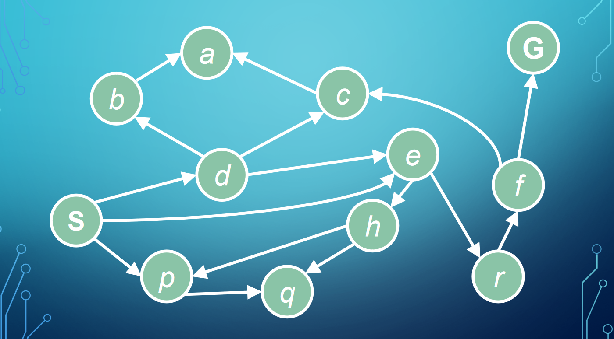
* S is the start state (in every graph)
* G is the goal state (in every graph)

## Search Trees
* A ==search tree== is a series of "what if" plans and their outcomes
* We can have duplicate states in search trees
* The start state is the root node
* Children correspond to successors
* Nodes show states but also demonstrate plans that achieve those states
* For most problems, we can never actually build the whole tree
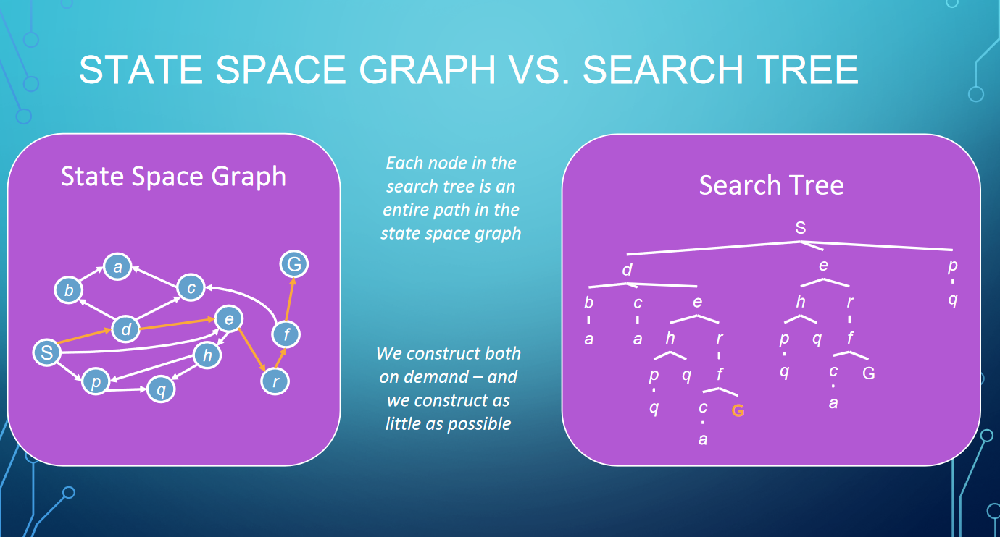

### Search Node
1. node.state is the state which the node corresponds
2. node.parent is the node in the tree that generated this node
3. node.action is the action that was applied to the parent's state to generate this node
4. node.path-cost is the total cost of the path from the initial state to this node (G function)

# Uninformed Search Algorithms
* When searching for a solution, we might not have any clue about how close a state is to the goal
* There are various ==uninformed algorithms== that use different strategist to try to find a solution to the problem
* These algorithms superimpose a search tree over the state space graph

## Best-First Search
* Start at the initial state for the problem
* On each iteration, choose a node $n$ with minimum values of some ==evaluation function== $f(n)$
    * Return this state if it is a goal state
    * Otherwise, expand the state to generate child nodes

### Implementation
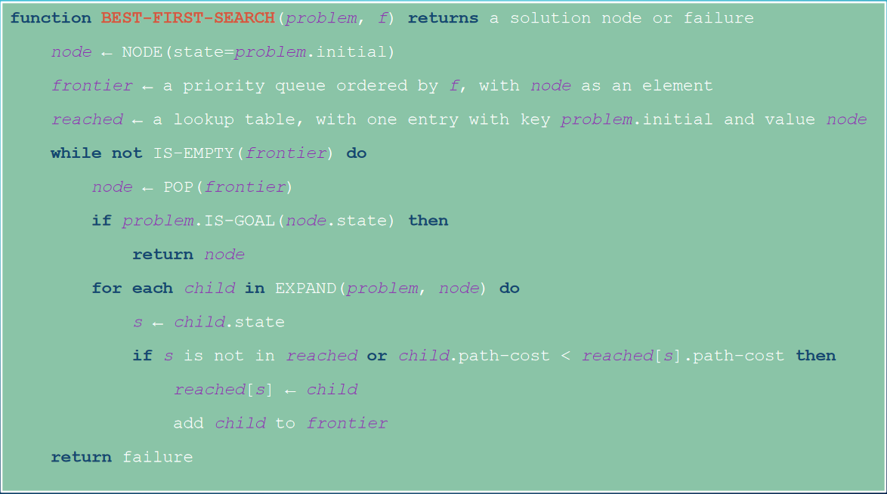
* The keys of the `reached` dictionary are the states, the values are the nodes themselves

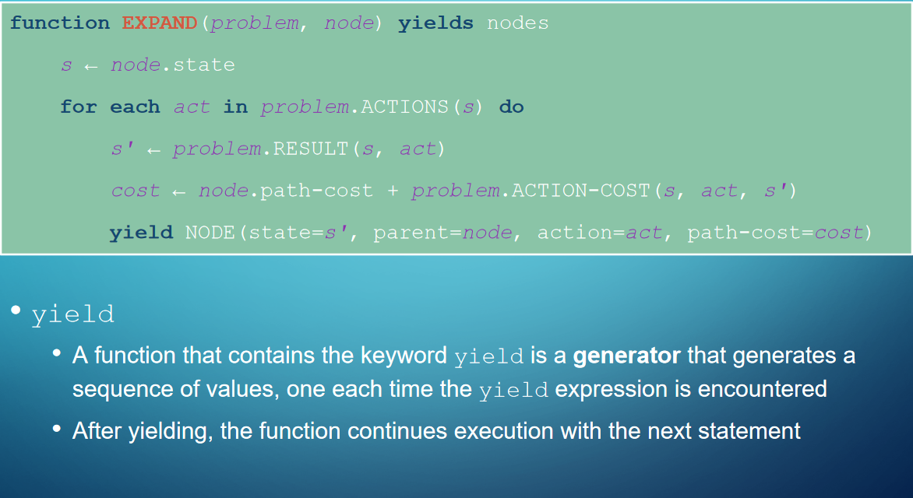
* Gives us all of the children from a state when performing all actions. Yield lazily generates all of the possible child nodes

## Breadth-First Search
* Start the problem at the initial state
    * Expand this node and find successor states
    * For these successors, expand them and find their successor states
    * Repeat until goal is found or until the whole state space is covered
* Will search the state space in waves of uniform depth
* Doesn't care about optimizing cost

### Effeciency
* If all actions have the same cost 
    * If a solution exists, it finds the most cost optimal solution
* Memory concerns: Say the tree generates b children per node, and takes d tiers to get to the solution

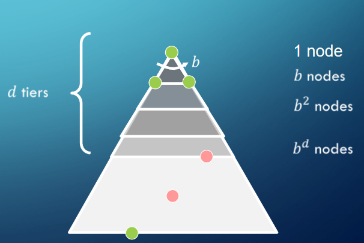

### Graph Form
* Each color represents a search depth

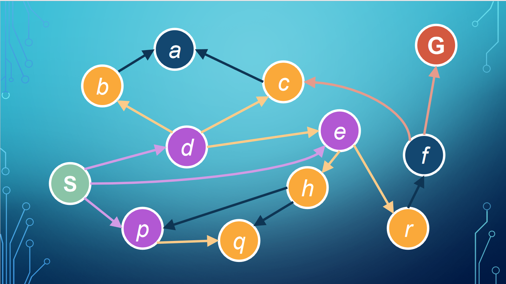

### Tree Form
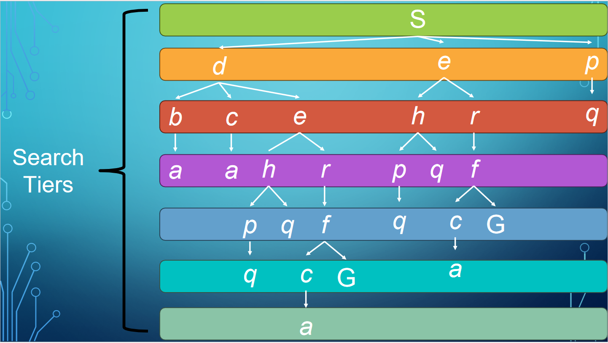

### Implementation
* You can implement it using Best-First Search, you'll need the depth of the node as your order function
* Speed inefficient in three ways
    * Priority queue not necessary, no priority function necessary
    * Lookup table not necessary, use a set instead
    * Goal checked before child nodes generated, better to do it while nodes are generating. You're not checking for how cheap it is to get to the goal

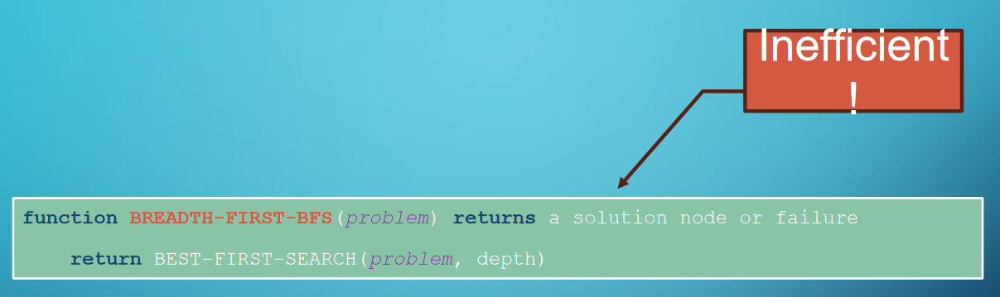

* More efficient way
* We need to check if the initial node is the goal.

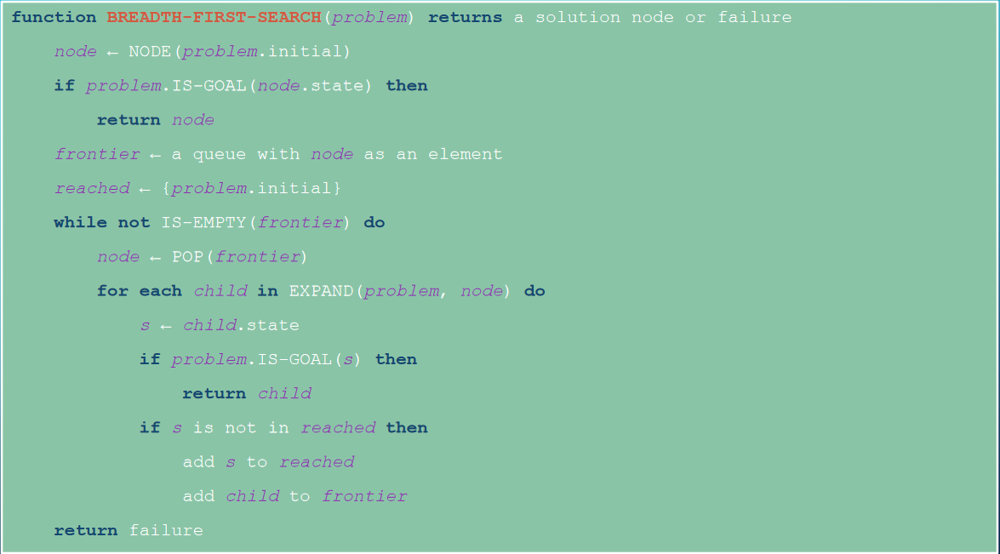

## Uniform-Cost Search (Dijkstra's algorithm)
* When actions have different costs, a simple idea is to expand the cheapest node first according to its path-cost
* Aka Dijkstra's algorithm

### Graph View
* Will look at all paths and go with the cheapest path possible

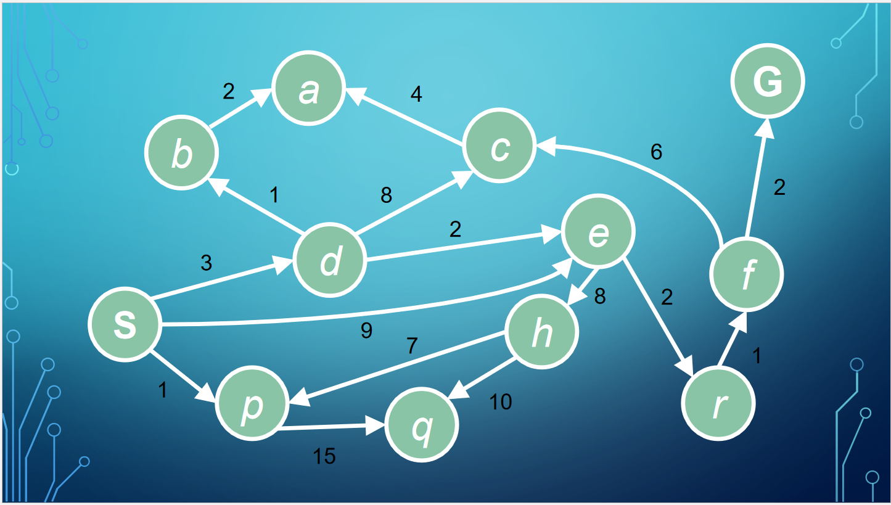

### Tree View
* The path costs here are cumulitive. 1 on top 0 on bottom is 10.

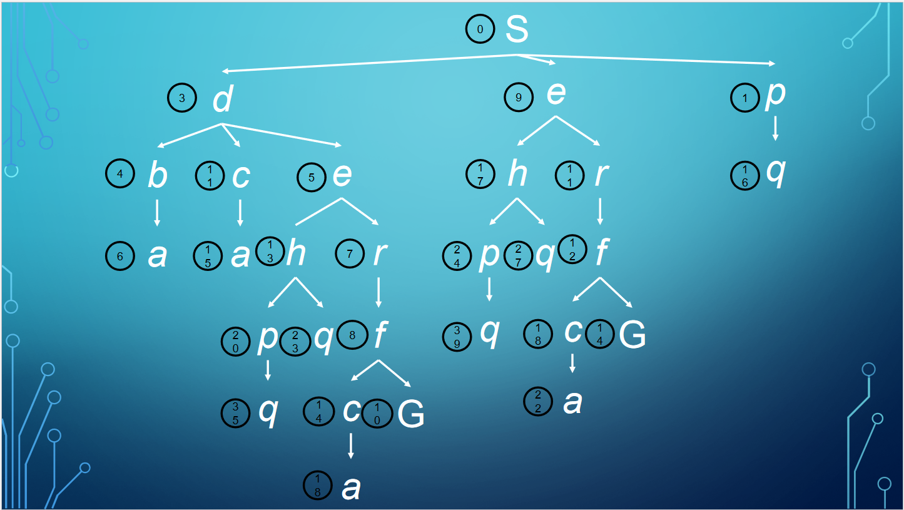

### Implementation

### Efficiency
* Works when action costs are different
* Guaranteed solution is cost optimal
* Memory requirements even worse than Breadth-first Search
* Let $C^*$ be the optimal cost & $\epsilon$ is the smallest action cost

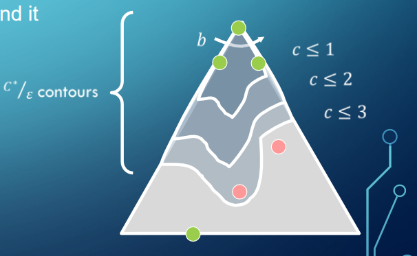

## Depth-First Search
* Keep choosing the deepest node in the frontier first
* If no more nodes, go back to the next deepest node
* Doesn't care about cost

| Senarioes To Consider | Descriptions |
| :--: | -- |
| 1: | Finite & Acyclic state spaces, will find goal if exists, state may repeat |
| 2: | Finite and cyclic state spaces, can get stuck in a loop |
| 3: | Infinite state spaces, an get stuck in an infinite path |

## Cycles
* A ==Cycle== is a path that starts and ends on the same graph
* ==Acyclic== means no cycles

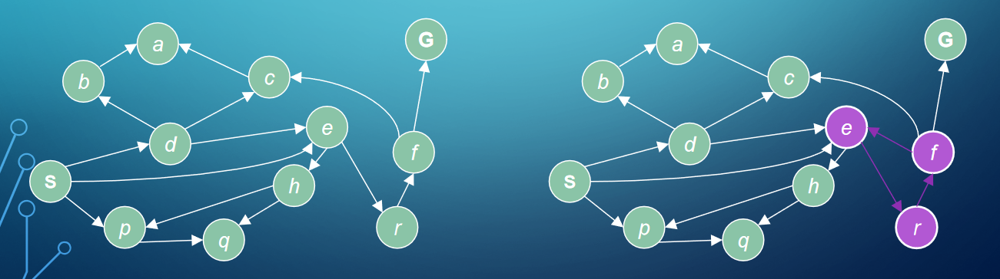

### Implementation
* Inefficient
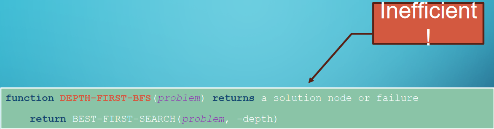

* Efficient
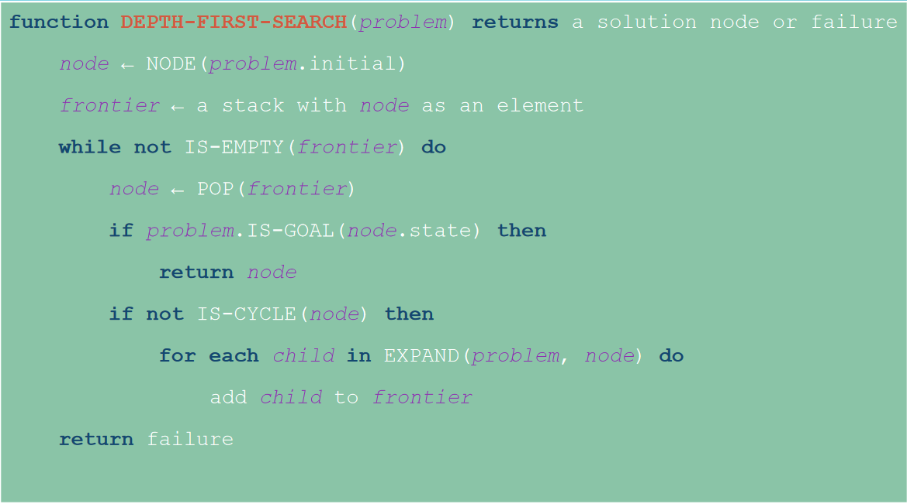

### Effeciency
* Less memory than other Uninformed Search Algorithms
* Solution may not be cost optimal
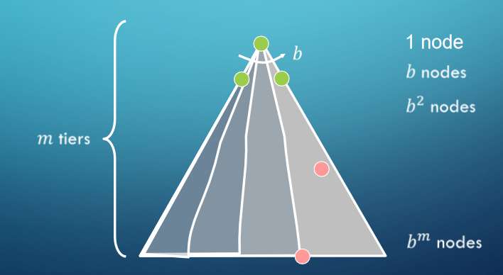

## Depth Limited Search
* Depth First Search's cooler brother
* Cut off the depth at some number L, don't go past it
    * Choice of L really matters
### Efficiency
* Depends on l
* Limited memory requirements like DFS
## Iterative Deepening Search
* Solves problem of picking L
    * Start at level 0, then try level 1, level 2, etc
    * Stop when you find a solution or failure
### Efficiency
* Modest memory like DFS
* Will find cost-optimal solution like BFS, if uniform action cost

### Implementation
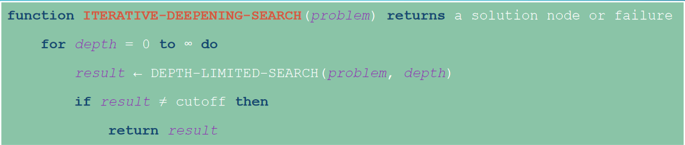
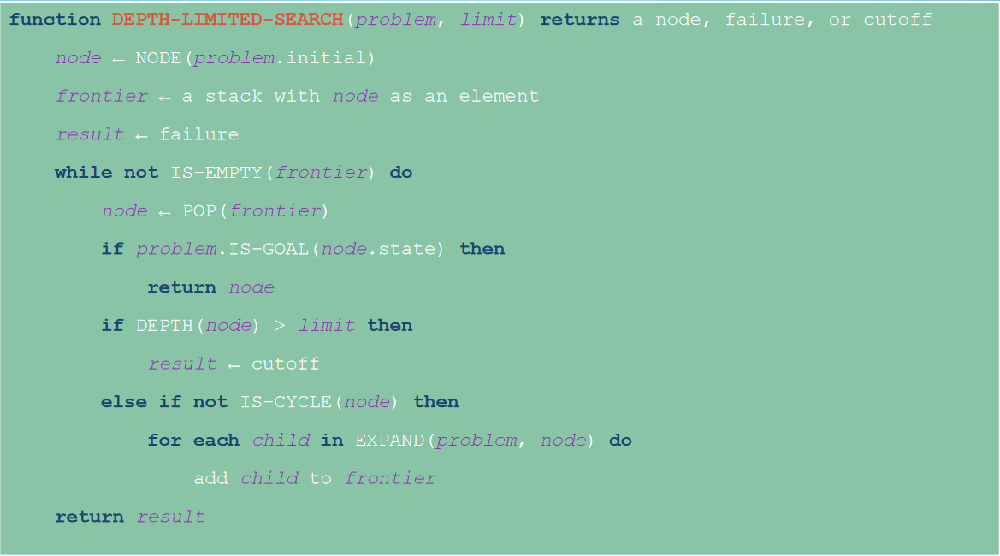

# Informed Graph Algorithms
* uses domain specific hints about the location of goals
* hint comes in the form of a heuristic function $h(n)$
* $h(n)$ is the estimated cost of the cheapest path from the state at node $n$ to a goal state

Example graph for all algorithms
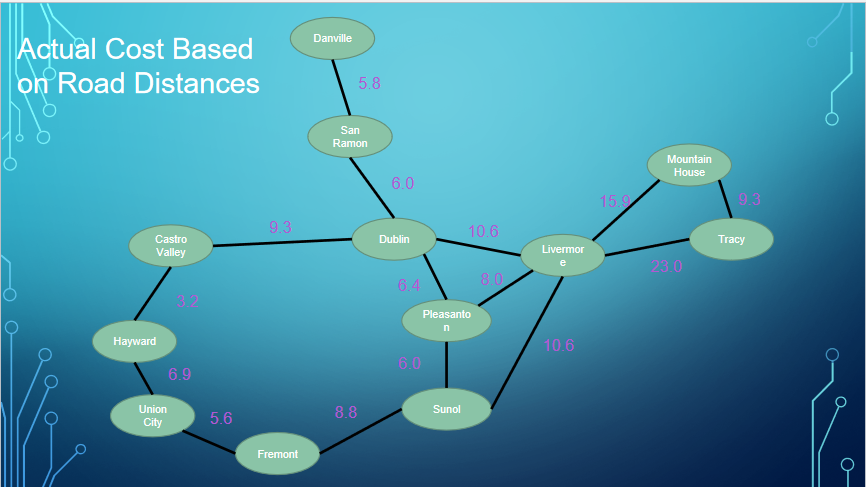
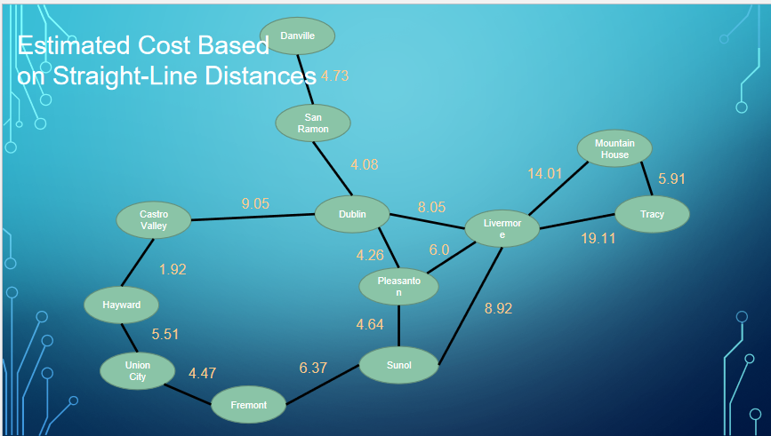

## Greedy Best-First Search
* Expands the node with the lowest $h(n)$ value
	* Pick the node that is closest to the goal
	* makes eval function $f(n) = h(n)$
* For finite state spaces, A solution can be found if it exists
	* Solution not guarantee to be cost optimal

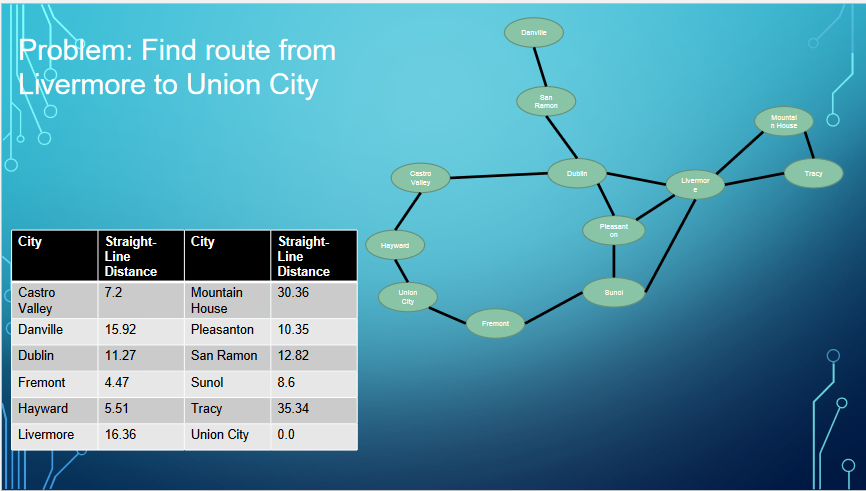
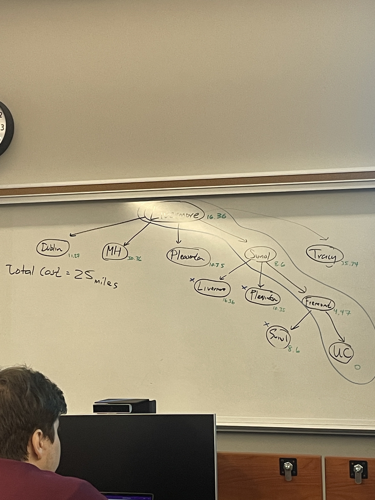
The green number is the heuristic number which is the straight line distance

### Implementation
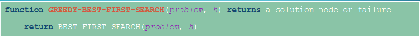

## A* Search
* Accounts for path cost along with heuristic
	* $f(n) = g(n) + h(n)$
	* $g(n)$ is the path cost

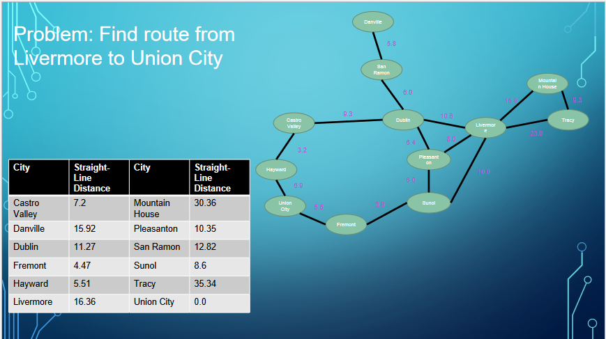
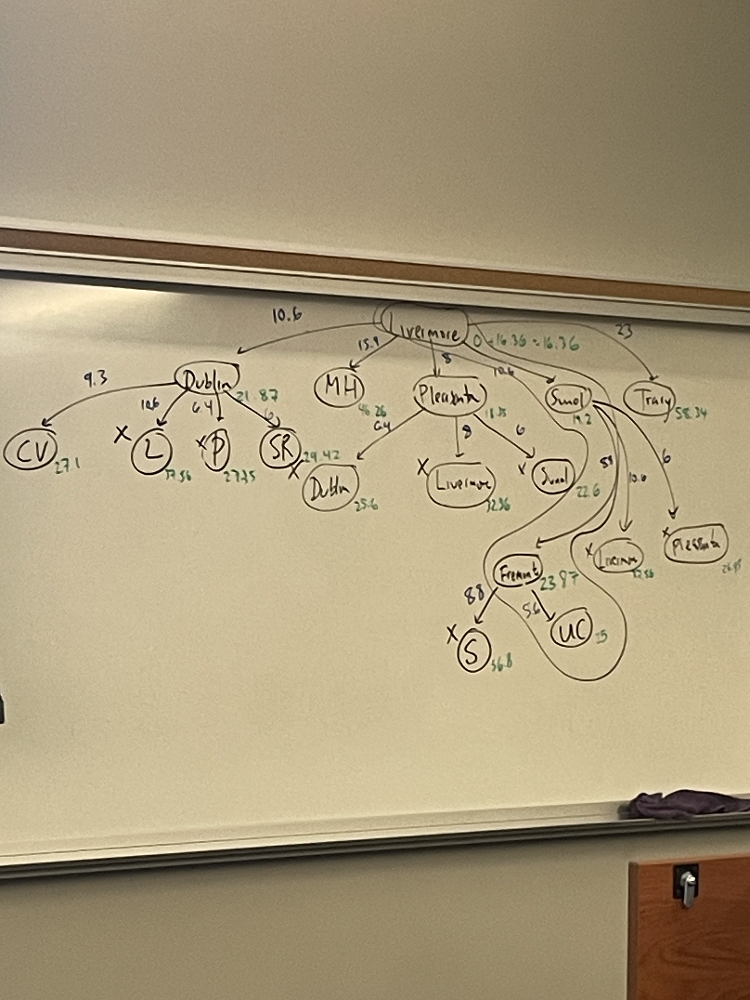
The green number is the total (heuristic + total driving distance from start) & the blue number is the real driving distances between cities. The heuristic is in the chart

### Implementation

### Efficiency
* For finite state spaces, A* will find a solution, if it exists
* Weather the solution is cost-optimal depends on the heuristic
* A* keeps the entire explored region in memory
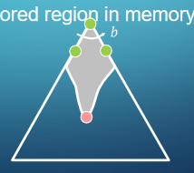

* If $h(n)$ is ==admissible== then A* solution is cost optimal
* $h(n)$ ==admissible== if never overestimates the true cost to reach a goal
$$ h(n) <= \sum_{i = 1}^{k+1} c_i $$
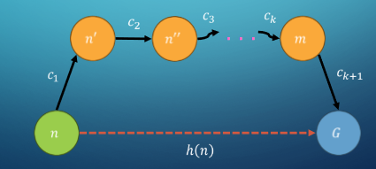
* If $h(n)$ is ==consistent==, then A* solution is cost-optimal and we never have to readd a state to the frontier
* For every node $n$ and every successor $n'$ of $n$ generated by an action $a$
* $h(n) <= c(n, a, n') + h(n')$
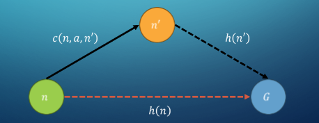
* Preserves triangle inequality

## Heuristic Functions
* When Dealing with grid-based environments, ==Manhattan Distance== is common & Consistent
	* Works only in moving left right, up down
	* Counts distance from one location to another on the grid using the sum of horizontal and vertical distances (no diagonals).
### Measuring Heuristic Performance 
* One way is the ==Effective Branching Factor== b*
* If A* generates a total of $n$ nodes and the solution is found at depth $d$

$$n + 1 = 1 + b* + (b*)^2 + ... (b*)^d = \sum_{i=0}^d (b*)^i = \frac{1-(b*)^n}{1 - b*}$$

* A well-designed heuristic would have a value of b* close to 1

### Comparing Heuristic Functions
* Given two, consistent heuristic functions, $h_1\& h_2$, how do we know which one is better?
* For any node n
	* We have that $h_2(n)>=h_1(n)$
	* We say $h_2$ **dominates** $h_1$
* Domination translates directly to efficiency 
	* $h_2$ will never expand more nodes than $h_1$ 
* General rule: pick the consistent heuristic with higher estimates

Worst Heuristic is the zero heuristic, $h(n) = 0$, best heuristic is the exact value. 

### Generating Heuristics Through Relaxation
* It's possible to generate heuristic functions by examining simpler versions of the problem 
* Fewer restrictions on actions, states stay the same, ==relaxed problem==
* State space graph of relaxed problem is the same as the original problem, but more edges

#### Auto-Generation
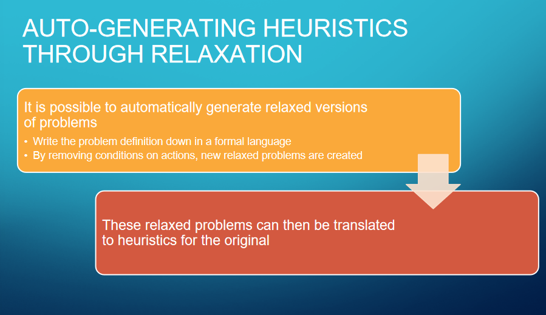 

### Combining Heuristic Functions
* Suppose you have many available heuristics with similar b* values & no clear dominator
* Can create a ==composite heuristic function== that chooses the best one 
$$h(n) = max(h_1(n), h_2(n), ... h_m(n))$$
* Drawback: more computation time

## Weighted A* Search
* Even with good heuristics, A* can still expand a lot of nodes 
* We can reduce this work if willing to accept suboptimal solution, called ==satisficing solutions==
	* Weighing the heuristic estimate more heavily than the path-cost
	* $f(n) = g(n) + W * h(n)$ for some W > 1
	* Allows inadmissible heuristics to be potentially useful,
	* Overestimating is useful in this case

### Implementation 
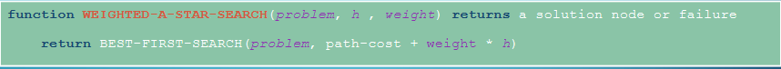