#AI
## N-Queens Problem
* Environment: a chess board of size n x n with n queens 
	* n = 1 or n >= 4
	* Queens can move through each-other to capture other queens
* State: n queens on the board, one per column
* Actions: move a queen in its column
* Goal: n queens on the board with no conflicts
* Heuristic: number of conflicts

# Local Search Algorithms
* Searching from a start state to neighboring states
* Don't keep track of the path, nor the states that have been recorded

Ex: Job schedules, we don't care about how the schedule was made, just the final schedule

| Pros | Cons |
| :--: | :--: |
| low memory | Not systematic |
| Can often find reasonable solutions in large or infinite state spaces | |
| Useful to solve optimization problems | | 

### Environment Type Assumptions
* Fully observable
* Deterministic
* Static
* Known
* Discrete

### Objective Function (Performance Measure)
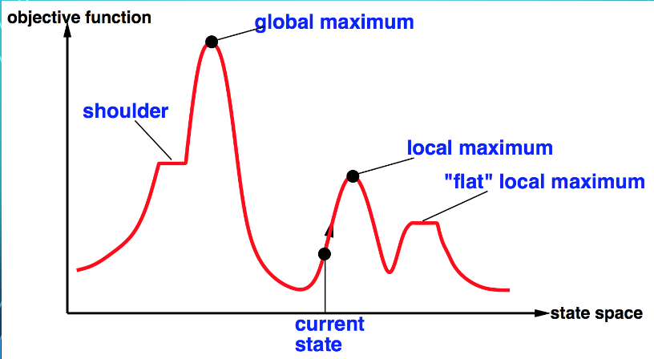
* The maximum of the objective function is what we want
* Plateaus are the shoulder or flat local max

## Hill-Climbing Search
* Keeps track of just the current state 
	* Move to the best neighboring state
	* Stop when no neighbors are better
* Moves in direction of steepest ascent
* Can use heuristics

### Implementation

### Solving N-Queens Problem
* The h value & other numbers are the heuristic
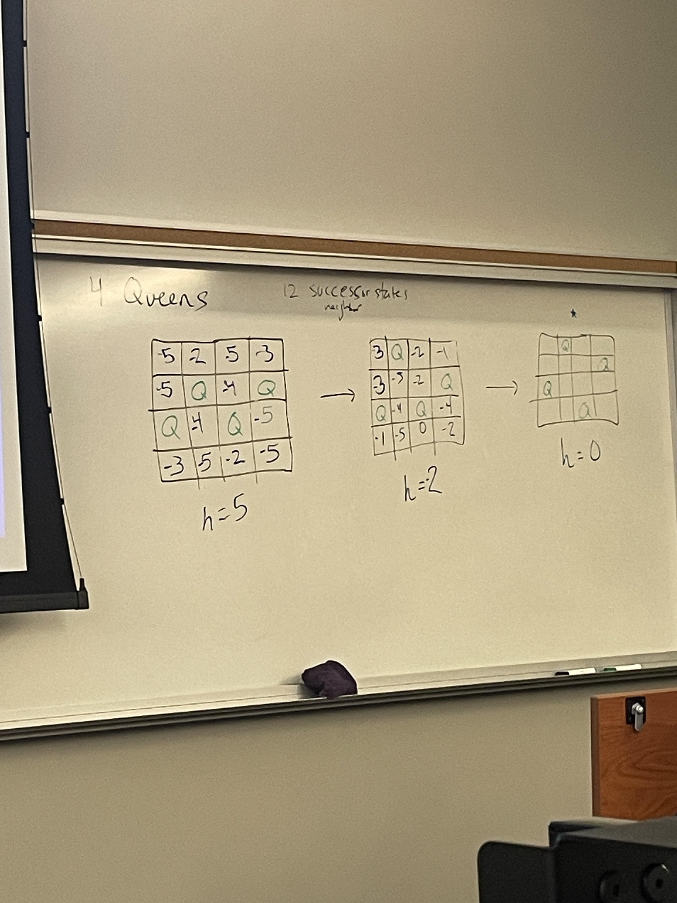

### Performance
* Known as greedy local search
* quickly makes progress towards sol.
* Often gets stuck
	* Local maxima, ridges, plateaus

### Improvements
* Sideways moves, (move to a state with same objective value)
	* Cap this number so no infinite loops
* Increases success percentage, increases number of steps

### Variations
| Stochastic Hill Climbing | First-choice hill climbing | ==Random-restart hill climbing== |
| :--: | :--: | :--: |
| chooses at random from among the uphill moves | generates successor states in random order, stopping when it finds one that's better than the current state | conducts a series of hill-climbing searches from randomly generated initial states until a goal is found (guarantees optimal solution) |

Expected Times Random-restart hill climbing is expected to run
* 1/P(hill-climbing finding a solution)

## Simulated Annealing
* Version of stochastic hill climbing, allowing downhill moves
* Perspectives: can be used for steepest ascent or ==gradient descent==
* We can shake the state space to get out of local minimums, start with strong shacking, then weaken the shakes
* Guaranteed to find optimal solution given enough time to run (we don't know how long it needs to run)

### Implementation
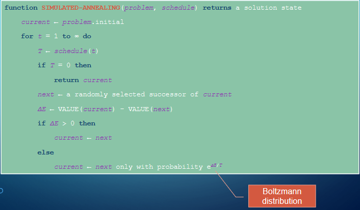
* Bigger T means more violent shaking, Less T less so

### Temperature Schedule
* Common schedule from Newtons law of cooling
	* "The rate of heat loos of a body is directly proportional to the difference in temperatures between the body and its environment"
* $S(t) = ke^{-rt}$
	* $k$ is initial temperature
	* $r$ is the "coefficient of eat transfer" (smaller number means slower decay) (VERY IMPORTANT)
	* $r$ will depend on the problem

### Performance
* Slowly enough could mean a long time
	* Can adjust schedule to return 0 once a certain limit is reached
	* May not be optimal but satisficing

## Local Beam Search
* keeps track of at most $k$ states rather than just one
* Basic idea
	* Start with at most $k$ randomly generated states
	* Find all their successors and stop if goal is found
	* Otherwise, pick at most $k$ best successors states and repeat
* Parallel states communicate useful info

### Efficiency
* It's possible to get stuck at a local maximum, like hill-climbing search
* Suffers from lack of diversity

### Example
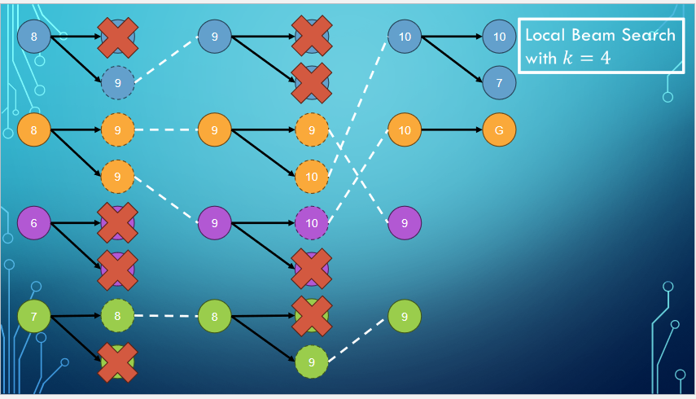

### Implementation
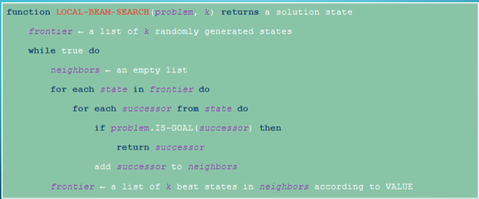

## Stochastic local beam search
* Don't choose at most $k$ best successors, choose at most $k$ successors with probability proportional to the successor's values
	* If we choose the best, we could get stuck like before

# Genetic Algorithms
* Nature-inspired versions of stochastic beam search
	* Population of individuals are the states
	* The fittest individuals (highest values) produce offspring
	* These offspring become the next generation of individuals

* The ==mixing number== $/rho$ is the number of parents that come together to form offspring
	* When $\rho = 0$, we have stochastic local beam search
* The ==selection== process selects the individuals who will become the parents of the next generation
* The ==recombination== (not the biology term) procedure forms the offspring
	* When $\rho = 2$, a ==common approach== is to use a crossover point to split each parent into two parts, combining each part to form two children

* The ==mutation rate== determines how often offspring have random mutations
* Optionally, adjustments to the next generation can be done
	* ==Elitism== includes a few top-scoring parents from the previous generation
	* ==Culling== removes all individuals below some threshold

### Example (N-Queens problem)
* Each file has one queen
* The numbers represent the rank of each queen on the board

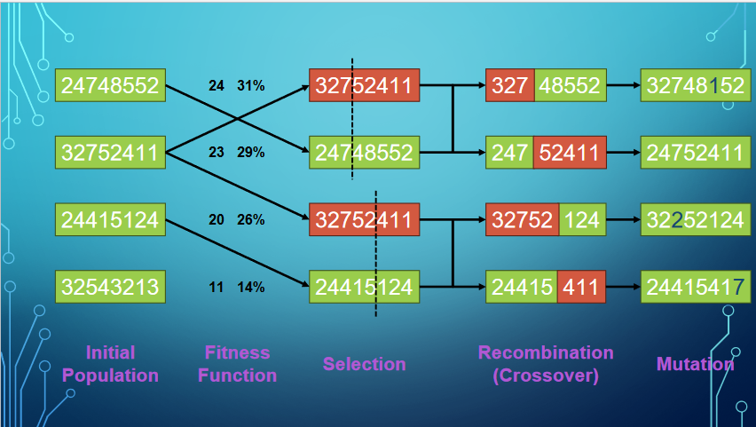

The fitness number on the left is the number of pairs of non-attacking queens

==Normalizing== calculates the chance our individual gets of being a parent. Ensures all probabilities add up to 100%
$$P(s) = \frac{f(s)}{\sum_{i=1}^{n} f(s_i)}$$ where $s$ is the individual

We select the parents by chance and divide each up into two sections

The children are a mix of the two pieces of each of the parents

Then have random mutations on the children maybe

### Implementation of the common approach

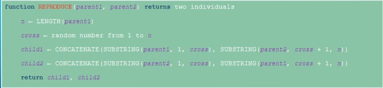

* Run until optimal individual found or enough time has elapsed

# Search With Non-Deterministic Actions
* Agent doesn't know what state it transitions to after taking an action

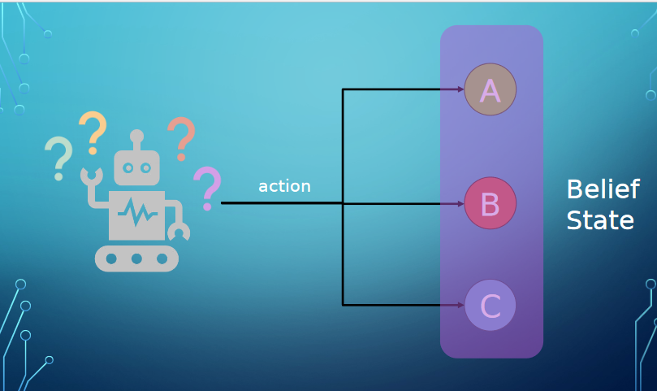

* ==Belief state== is the set of states that the agent believes are possible
* Solution to a problem is no longer a sequence of actions
* ==Conditional plan== or ==Contingency plan== or ==Strategy== specifies what to do depending on what precepts the agent receives while executing the plan

* We have to generalize the transition model because we're non deterministic
	* Originally, used RESULT() function to get a single state
	* Now, use RESULTS() function to return a set of possible outcome states
* A conditional plan can contain if-then-else steps
	* Solutions are now trees rather than sequences

## AND-OR Search Tree
* In deterministic environments, the branches in a search tree represented different possible actions our agent might take
	* Let's call this an OR node
* In non-deterministic environments, there is also branching introduced by the environments choice of outcome for each action
	* Let's call this an AND node
* In an AND-OR search tree, alternate between these two types of nodes

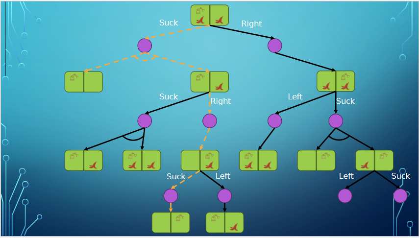
* The State pictures are the OR nodes
* The Purple nodes with this arc are the AND nodes
* The yellow dotted line is the solution
* Duplicate states are generated, need to avoid those
* This Graph Reminiscent of BFS

* Solution has 3 requirements
	* A goal node on every leaf
	* One action at each of its OR nodes
	* Every outcome at each of its AND nodes

### Implementation
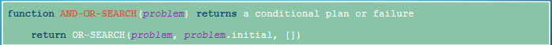
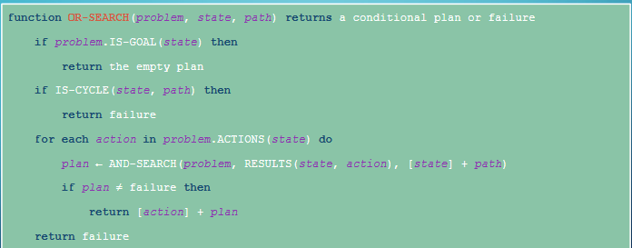
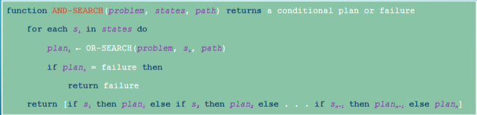

Use a dictionary for the return value in AND-SEARCH with the state as the keys and the values as the plan.
This implementation is like DFS

Loads of different varieties of AND-OR search