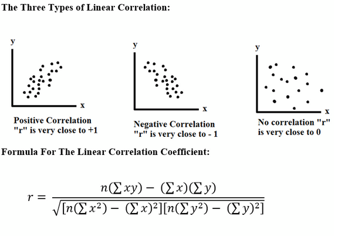
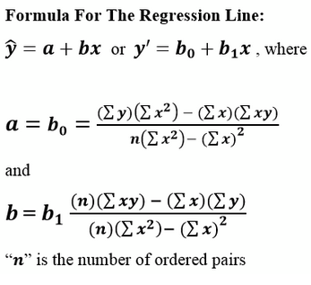

#stats
# Linear Correlation
*Correlation:* between variables "x" & "y" tells us how they are somehow related to each-other.

*Ordered Pair:* are two variables that could correlate to each-other

*Linear Correlation Coefficient:* Denoted by $r$. Always, $-1 \le r \le  1$ Measure of strength of linear correlation between two variables being compared. 

# Testing For A Correlation Between Two Variables Using Hypothesis Test
1. Claim: $\rho \ne 0$ (this is a correlation)
2.
	a. $H_0: \rho = 0$
	b. $H_1: \rho \ne 0$
3. Apply t-distribution
4. Find test statistic
$$t = r * \sqrt{\frac{n - 2}{1 - r^2}}$$
	where n is # of ordered pairs
5. Find critical values of t distribution table. Two degrees of freedom $df = n - 2$. Always *Two Tailed test*
6. Find p-value with `tcdf`
7. Determine whether there IS or IS NOT a correlation between two vars
	1. If $-t < r < t$, there is not a significant correlation between the two tests.
	2. if $p \ge \alpha$ where $\alpha$ is the significance level, we fail to reject the null hypothesis, meaning there is more evidence there isn't a correlation

# Constructing Scatter Plot In TI-84
1. Put both sets in list L1 & L2 respectively
2. Press 2nd Y
	1. Plot 1 .. On,
	2. Type: Select the first one (scatter plot)
	3. Xlist: 2nd => 1 will type L1
	4. YList: 2nd => 2 will type L2
	5. Mark: select the first one (square tick mark)
3. Press the "Window button to adjust values for x & y accordingly, so that all of the points are displayed on the scatter plot"
4. Press the "Graph" button to see the square tick marks. This should be the desired scatter plot
# Using TI-84 To Compute Test Statistic, Linear Correlation Coeffecient, And The P-value:
1. Stat => Edit, input x vals in L1 and y vals in L2
2. Press Stat => Tests => LinRegTTest. Input following. Be sure to highlight $\rho \ne 0$
	1. Xlist: 2nd => 1 will type L1
	2. Ylist: 2nd => 2 will type L2
	3. Freq: 1
	4. $\beta \& \rho \ne 0$
	5. RegEQ:
	6. Calculate
This will give the "t" which is the test statistic, the p-value, and the linear correlation coefficient "r" all the way at the bottom

# Linear Regression
*Regression Line:* is the line of "best fit" between two vars $x$ and $y$

They make useful predictions about the future values of $x$ & $y$

### Whether To Find Regression Line
1. Construct scatterplot
2. Determine if linear coefficient $r$ is significant.
3. Use the following formula

* You can also use `LinRegTTest` on a TI84 Calculator

### Finding Best Predicted Value For "y" Given "x"
1. Construct scatter plot
2. if $r$ is significant, sub in explanatory value of $x$ into regression line equation $\hat{y} = a + bx$ or $y' = b_0 + b_1 x$
3. if $r$ is not significant, don't find regression line equation. Find the *mean* of the y - values ($\bar{y}$) on the given chart for the problem.

*Residual:* difference between observed value in sample for $y$ and predicted $y$ value $y'$. $y - y'$
