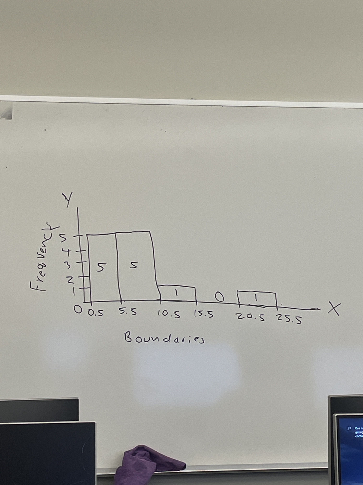
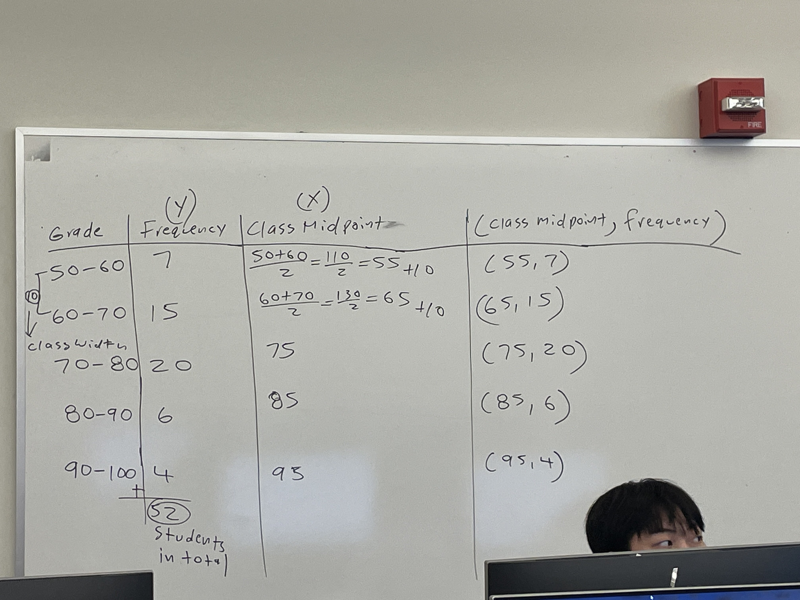
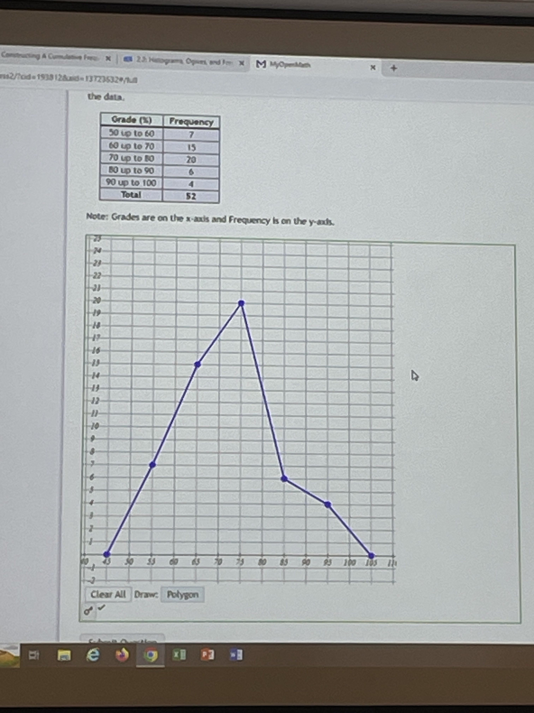
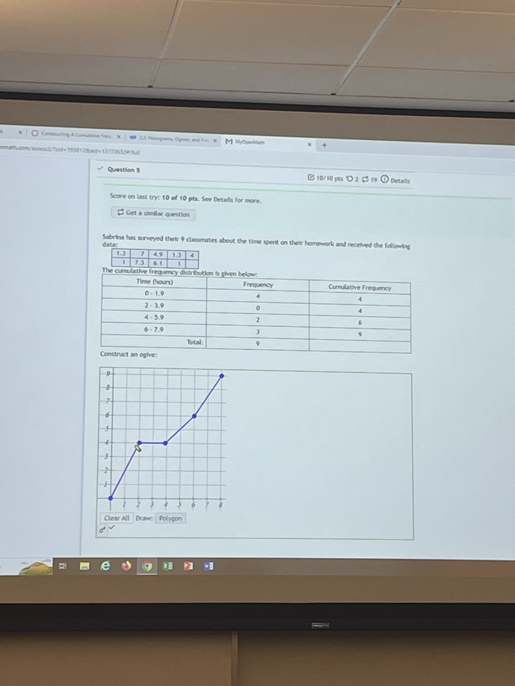
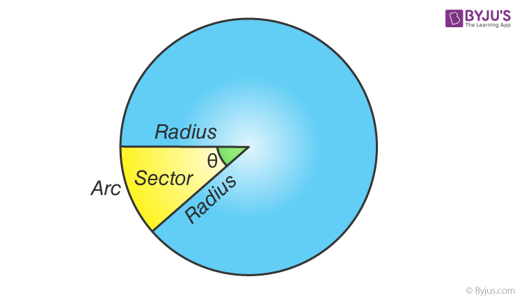
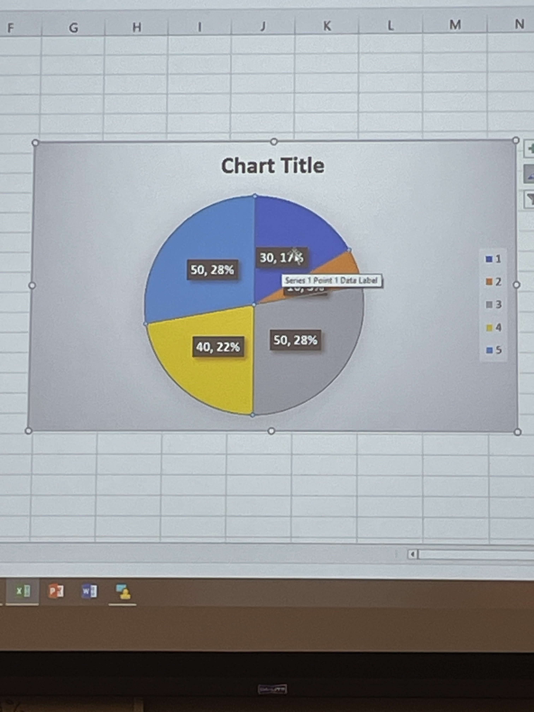

#stats 
# Frequency Distribution Table
## Number of Hours Studied by students

## Terms
* The **Class** is a range of numbers, we see that on the left
* The **Lower Class limits** are on the left side of the range
* The **Upper Class limits** are on the right side of the range

* The **Class Midpoint** of a class is the average of the lower and upper limit
$$\frac{upper limit + lower limit}{2}$$
* Ex: $\frac{1+5}{2} = \frac{6}{2} = 3$

* **Class boundaries** are the numbers used to separate classes so that there are no gaps in frequency distribution
* Finding the class boundary involves
* Find the **key number**
$$\frac{\text{current lower class limit} - \text{previous upper class limit}}{2}$$
* The **Class width** of a class is the lower limit of one class minus the lower limit of another

* The **Frequency** is the number of data points in your sample

## Constructing A Frequency Distribution Table
1. Find the class width
    * get the highest data value, subtract the lowest data value, and divide by the number of classes
    * round the result up to the next number, even if the result is an integer
1. Find the class boundaries
2. Build the table

## Building a Histogram
* It's made up of rectangular bars
* The height of each rectangle are the frequencies, y-axis, for each class
* The width of each rectangle is just the class width
* The "class boundaries" on the x-axis
* Generally, no gaps between each rectangle

## Constructing a Cumulative Frequency Table
* We must use the class boundaries and sum each "current" frequency with the "previous" ones:

## Frequency Polygon
* Made up of line segments
* Contains _class midpoints_ on x-axis
* Contains each _corresponding frequency_ on the y-axis
* Plot: (class midpoint, frequency)
* Connect the dots
* Use x-axis to close the figure
    * To close figure, subtract class width from lowest x coord, and add class widht
    * h to highest x coord, both y coords 0
#### Students taking an exam example
* Table

* Frequency Polygon

## Ogive Plot
* Made up of ordered pairs connected via line segments
* Put _class boundaries_ on the x-axis
* put _cumulative frequencies_ on the y-axis
* Example

## Relative Frequency
$$\frac{individual  frequency}{sum  of  all frequencies} = \frac{f_i}{\sum{f_i}}$$

| Class | Frequency | Relative Frequency |
| ----- | --------- | ------------------ |
| 1 - 5 | 5 | $\frac{5}{12} = 42\%$ |
| 6 - 10 | 5 | $\frac{5}{12} = 42\%$ |
| 11 - 15 | 1 | $\frac{1}{12} = 8\%$ |
| 16 - 20 | 0 | $\frac{0}{12} = 0\%$ |
| 21 - 25 | 1 | $\frac{1}{12} = 8\%$ |

## StemPlot (Stem and leaf plot)
* For all data values, the table has TWO columns
    * First column is the **stem** which is all digits in a number except for the very last one
    * Second column is the **leaf** which is the very last digit of each number

| Example Chart | | |  |  |  |  |  |
| ---  | --- | --- | --- | --- | --- | --- |
| 110's | 110 | 111 | 117 | 118 | 118 | 119 |
| 120's | 121 | 124 | 124 | 124 | 127 | 127 |
| 130's | 134 | 136 | 136 | 136 | 136 | 139 |
| 140's | 140 | 142 | 144 | 144 | 148 |
| 150's | 152 | 153 | 153 | 155 |

This is the plot

| Stem | Leaf |
| :--: | :-- |
| 11  | 0 1 7 8 8 9 |
| 12 | 1 4 4 4 7 7 |
| 13 | 4 6 6 6 6 9 |
| 14 | 0 2 4 4 8 |
| 15 | 2 3 3 5 |

## Pie Chart (Circle Graphs)
* Made up of wedges (sectors)
    * A sector is a formed by two radii in the circle (doi) where $\theta$ is the central angle
    * There are $360\degree$ of the circle, each sector is a portion of that

### Popular Burger Joints
| Restaurant | Number of People who Dine | Degree of Sector | Percentage of Circle |
| :--: | :--: | :--: | :--: |
| Burger King | 30 | $\frac{30}{180} * 360\degree = 60\degree$ | $\frac{30}{180} * 100\% \approx 17\%$ |
| McDonalds | 10 | $\frac{10}{180} * 360\degree = 20\degree$ | $\frac{10}{180} * 100\% \approx 6\%$ |
| In-n-out | 50 | $\frac{50}{180} * 360\degree = 100\degree$ | $\frac{50}{180} * 100\% \approx 28\%$ |
| Dairy Belle | 40 | $\frac{40}{180} * 360\degree = 80\degree$ | $\frac{40}{180} * 100\% \approx 22\%$ |
| The Habit | 50 | $\frac{50}{180} * 360\degree = 100\degree$ | $\frac{50}{180} * 100\% \approx 28\%$ |
| Total Surveyed | 180 |

