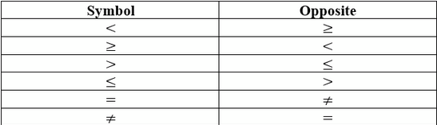
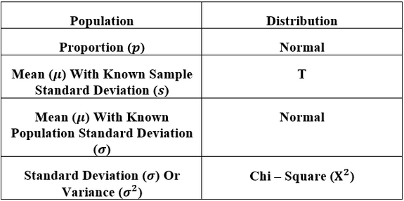
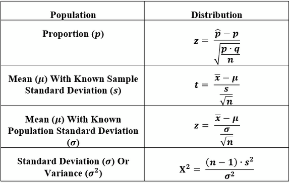

# 8 Step Process For Hypothesis Testing
1. State the original claim. Read the question carefully and understand verbally, then symbolically state it **as an inequality**
2. State the opposite of the original claim

3. State the null and alternative hypotheses.
==Null Hypothesis== $H_0$ claim always contains an (=) sign, no matter the original claim
==Alternative Hypothesis== ($H_1$ or $H_a$): Look at original & opposite of original claim. Select which one contains less than (<) symbol (Left - Tailed test), the greater than (>) symbol (Right - Tailed Test), or the not equal ($\not=$) symbol (Two - Tailed test). Only three symbols we are allowed to have
4. State the significance level $\alpha$
5. State what distribution is needed

6. Calculate the test statistic

7. Find the p - value (the probability of the test statistic that is AT LEAST as extreme as the test statistic obtained from the sample, assuming the null hypothesis is true) and the critical value(s)
	* P - Value Method. To find p, first identify what type test you have. This comes from **the symbol of the alternative hypothesis** $H_1$ from 3.
	1. LEFT - TAILED ($H_1 <$): P value is the area to the LEFT of the test statistic from 6. in the distribution used
	2. RIGHT - TAILED ($H_1 >$): P value is area to the RIGHT of the test statistic from 6. in the distribution used
	3. TWO - TAILED ($H_1 \ne$): P value, 
		1. if test statistic negative, P is TWICE the area to the LEFT of the test statistic from 6. with appropriate distribution.
		2. if test statistic positive, P is TWICE the area to the RIGHT of the test statistic obtained in 6. with appropriate distribution.
	4. Once P value found, compare to significance level $\alpha$
		1. if $p \le \alpha$, reject null hypothesis.
		2. if $p > \alpha$, don't reject null hypothesis. Kind of accept it
	* Critical Value Method. You need to see the kind of test you have from alternative hypothesis (use $\alpha$ in `invNorm`)
	1. LEFT - TAILED ($H_1 <$): Put the ENTIRE significance level $\alpha$ in the LEFT tail of your distribution. There will only be ONE critical value
	2. RIGHT - TAILED ($H_1 >$): Put ENTIRE significance level $\alpha$ in the RIGHT tail of your distribution. There will only be ONE critical value
	3. TWO-TAILED ($H_1 \ne$): Put the HALF significance level $\alpha$ in each tail LEFT and RIGHT of your distribution, with half the area in each tail. There will be two critical values.
	4. Once you have the critical values, if the test statistic falls in the critical region (the region made with $\alpha$), REJECT the null hypothesis. If not, DON'T REJECT the null hypothesis
1. The conclusion. The whole point of testing a claim about a population parameter ($p, \mu, \sigma, etc$)
   * Type I error: mistakes of rejecting the null hypothesis $H_0$ when it's true
   * Type II error: mistake of failing to reject the null hypothesis $H_0$ when it's false

## Examples
Original Claim: $p > 0.5$
Opposite Of Original Claim: $p \le 0.5$
Null Hypothesis $H_0$: $p = 0.5$
Alternative Hypothesis $H_1$: $p > 0.5$

If we reject the null hypothesis, then there would be more evidence for the alternative hypothesis. But this is the *same* as the original claim we are testing. Thus, we WOULD have enough evidence to support it. This would be the conclusion.

If we failed to reject the null hypothesis, then we would be considering it. If we go with this, then there would be LESS evidence for the alternative hypothesis, which again is the same as our original claim. So, in this case there would NOT be enough evidence to support the

Original Claim: $p = 0.5$
Opposite Of Original Claim $p \ne 0.5$
Null Hypothesis $H_0$: $p = 0.5$
Alternative Hypothesis $H_1$: $p \ne 0.5$

Lets say that we reject our null hypothesis, then we would also be rejecting our original claim which we are testing for. So, the conclusion would be to NOT support the original claim

Likewise, if we failed to reject (kind of accept) our null hypothesis, then we would also be failing to reject (accept) our original claim which we are testing for since they are identical. So, the conclusion would be to SUPPORT the original claim.
