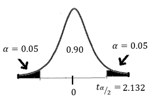

# Two Proportions
Use the 8 steps!
[[Hypothesis Testing]]

We get two proportions to test against each-other, with two samples to do. First has sub 1, second has sub 2.

For step 5:
Use normal distribution

For step 6:
Sample statistic:
$\hat{p}_1 - \hat{p}_2$
Standard Error:
$$\sqrt{\frac{\hat{p}_1*\hat{q}_1}{n_1}+\frac{\hat{p}_2 * \hat{q}_2}{n_2}}$$
Test statistic:
$$z = \frac{(\hat{p}_1-\hat{p}_2) - (p_1-p_2)}{\sqrt{\bar{p}*\bar{q}(\frac{1}{n_1}+\frac{1}{n_2})}}$$
where $\hat{p}_1 = \frac{x_1}{n_1}$, $\hat{p}_2 = \frac{x_2}{n_2}$, $\bar{p} = \frac{x_1 + x_2}{n_1 + n_2}$, $\bar{q} = 1 - \bar{p}$

For step 7: A new method
### Confidence Interval Method
We find the confidence interval of $p_1 - p_2$.
$$[(p_1-p_2) - E] < p_1 - p_2 < [(p_1-p_2) + E]$$
For left & right tailed test, put $\alpha$ on both sides of the distribution, subtract both sides from the curve to get the confidence level
For two tailed test, put $\alpha/2$ on both sides of the distribution, subtract both sides from the curve to get the confidence level 

our error for the interval
$$E = z_{\alpha/2} * \sqrt{\frac{\hat{p}_1 * \hat{q}_1}{n_1}+\frac{\hat{p}_2 * \hat{q}_2}{n_2}}$$
We can use `2-PropZInt(x1, n1, x2, n2, Confidence level)` from the `stat` button in the `test` section to calculate 
* Make sure everything is an integer. Use standard rounding for x1, x2, confidence level
Step 8: If 0 falls in the interval, null hypothesis supported

# Two Means
Now we get to compare two means

Step 5: T distribution
Step 6: Test statistic
$$t = \frac{(\bar{x}_1 - \bar{x}_2) - (\mu_1 - \mu_2)}{\sqrt{\frac{s_1^2}{n_1} + \frac{s_2^2}{n^2}}}$$
Step 7:
2 degrees of freedom $df_1 \& df_2$
choose the smaller degrees of freedom (not as accurate as the calculator)
Calculator uses messy formula to calculate degrees of freedom
`2-SampleTTest` not pooled to help
### Confidence Interval Method
interval:
$$[(\bar{x}_1 - \bar{x}_2)] - E < (\mu_1 - \mu_2) < [(\bar{x}_1 - \bar{x}_2)] - E$$
Error:
$$E = t_{\alpha/2} * \sqrt{\frac{s_1^2}{n_1} + \frac{s_2^2}{n^2}}$$
We can use `2-SampleTInt(xbar1, Sx1, n1, xbar2, Sx2, n2, Confidence level, pooled = false)` to calculate interval for us
Step 8: If 0 falls in the interval, then null hypothesis supported, otherwise not so

## Dependent Samples
We test the mean of the difference of two samples $\mu_d$
Step 6:
$$t = \frac{\bar{d}-\mu_d}{\frac{s_d}{\sqrt{n}}}$$
where $\bar{d} = \frac{\sum_{i=1}^{n}d_i}{n}$ (sample statistic), $\mu_d = x (from \text{ } H_0)$, x is the value in the claim, $s_d$ is the standard deviation of the set of differences between the samples, $n$ is the sample size

Standard Error:
$\frac{s_d}{\sqrt{n}}$

Step 7:
Only 1 degree of freedom this time.

### Confidence Interval Method
For left & right tailed test, put $\alpha$ the significance level on both sides of the curve

construct the confidence interval
$$\bar{d} - E < \mu_d < \bar{d} + E$$
$$E = t_{\alpha/2} * \frac{s_d}{\sqrt{n}}$$
If 0 is included inside the interval, we conclude there is no difference in the population parameters
If 0 is not included inside the interval, we conclude there is a difference in the population parameters

# Two Variances
$\sigma_1^2$ & $\sigma_2^2$
Use 8 Steps as usual
Step 5:
We are testing a claim about two variances, we will use the F-Distribution

Step 6:
$$F = \frac{s_1^2 \text{(larger)}}{s_2^2} or F = \frac{s_2^2 \text{(larger)}}{s_1^2}$$
Step 7:
We have two degrees of freedom $df_1 = n_1 - 1, df_2 = n_2 - 2$ for the F-Distribution, where $n_1 \& n_2$ are the sample sizes of each sample
Press 2ND, VARD, `Fcdf(lower limit, upper limit, df of numerator, df of denominator)` to get P value

