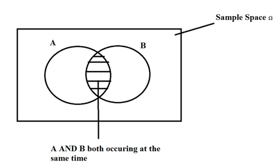
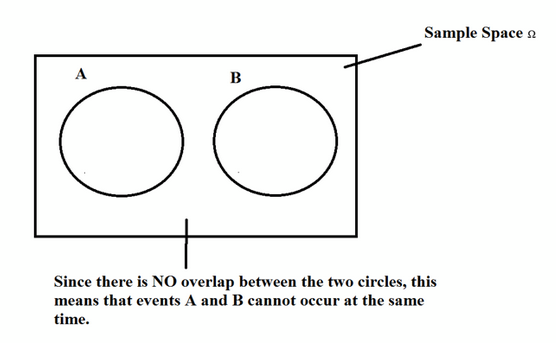

#stats
# Basic Probability
==Probability== of an event "A" is the chance of it occurring. It is denoted by "P(A)". Always between 0-1 inclusive
* 1 means guaranteed
* 0 means impossible

==Sample Space== is the set of ALL possible outcomes in an experiment. Often denoted by $\Omega$

Let l be the # of outcomes in A

==Classical Probability==
$$ P(A) = \frac{l}{\Omega} $$

==Compliment== is defined as the probability of an event "A" not occurring, sometimes denoted $\bar{A}$
1. $P(\bar{A}) = 1 - P(A)$
2. $P(A) = 1 - P(\bar{A})$

==Empirical Probability== Given A frequency distribution, the probability of an event "A" being in a given class is
$$ P(A) = \frac{\text{frequency for an individual class}}{\text{sum of all frequencies}} $$

Finding ==# of outcomes== in a sample space
$$ \text{(number of possibilities)}^\text{(number of trials)} $$
* number of trials is the amount of times you do an event
	* Rolling a die
	* Flipping a coin
	* etc

Finding the ==# of events== in a sample space
$$ 2^\text{(number of outcomes)} $$

## The Addition rule
==Compound Event== is any event combining two or more simple events

Events which happen at the same time

==Mutually Exclusive (disjoint events)== CANNOT occur at the same time

==Addition Rule==. Add P(A) to P(B), Subtract the overlapped part P(A AND B) since we added that piece twice. 
$$ P(A \text{ OR } B) = P(A) + P(B) - P(A \text{ AND } B) $$

==Multiplication Rule== is if two compound events, "A" & "B" can occur at the SAME time, then the overlap is "A AND B". 

If "A" & "B" are INDEPENDENT, meaning the outcome of one doesn't affect the other, then
$$ P(A \text{ AND } B) = P(A) * P(B)$$

If "A" & "B" are DEPENDENT, meaning the outcome of one depends on the other, then
$$ P(A \text{ AND } B) = P(A) * P(B|A) $$
where $P(B|A)$ is the probability of "B" GIVEN THAT "A" already happened

==Conditional Probability== is if we rearrange the formula for the multiplication rule to solve for $P(B|A)$ we get
$$ P(B|A) = \frac{P(A \text{ AND } B)}{P(A)} $$

==Probability Of At Least One== is
$$ P(\text{At Least } 1) = 1 - [P(\bar{A})]^{n} $$
where "n" is the number of trials

==Factorial==
$$ n! = n * (n - 1) * (n - 2) * ... * (3) * (2) * (1) $$
is the # of ways you can order things.

==Combination==
$$ _nC_r = \frac{n!}{(n - r)! * r!} $$
where n is the total number of different items and we select r out of n items without replacement
The order DOESN'T matter

==Permutation==
$$ _nP_r = \frac{n!}{(n - r)!} $$
where n is the total number of different items and we select r out of n items without replacement
The order DOES matter

==Permutation with Some Items Repeated==
$$ \frac{n!}{n_1! * n_2! * n_3! * ... * n_k!} $$
where n is the total number of items and $n_1, n_2, ..., n_k$ are the number of TIMES that the individual items appear

