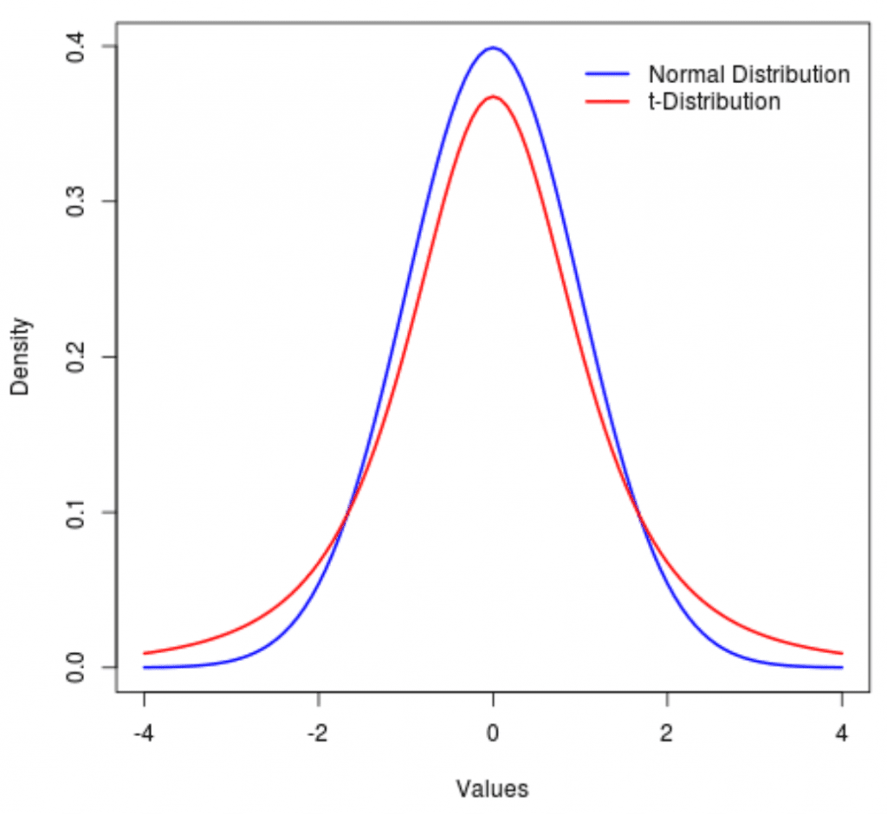
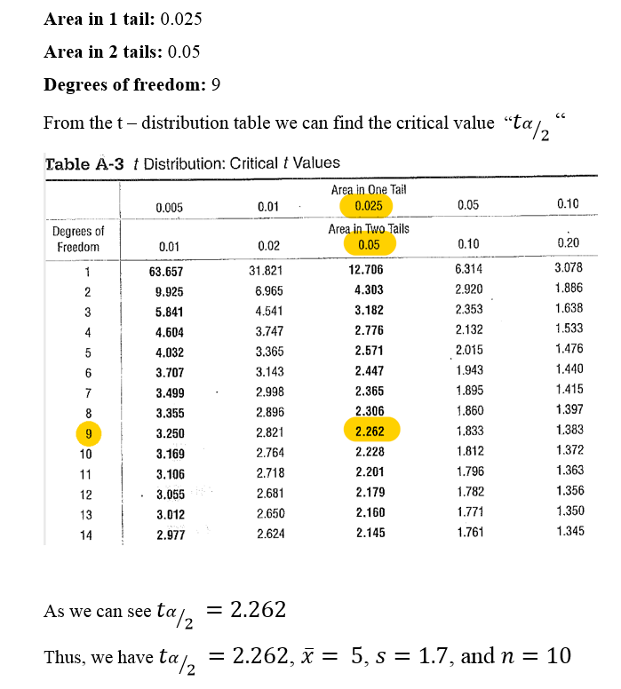
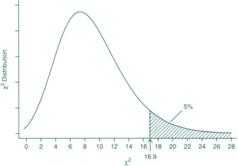

# Confidence Interval
range of values (lower limit to upper limit) used to estimate the "true" value of a **population parameter**

## Constructing A Confidence Interval
1. Use Normal Distribution
2. Gives the percentage (proportion) of values which something follows
3. Formulas
$$(\hat{p}- E) < p < (\hat{p} + E) $$
where $\hat{p}$ is the sample proportion $\frac{x}{n}$ where x is the amount of successes and n is the total sample size, and $E$ is the margin of error;
$$ E = z_{\alpha/2} * \sqrt{\frac{\hat{p} * \hat{q}}{n}} $$
$$ n = \hat{p} * \hat{q} * (\frac{z_{\alpha/2}}{E})^2 $$
where $z_{\alpha/2}$ is the critical value (z-score), $\hat{q} = 1 - \hat{p}$, and $n$ is the sample size

$\beta$ is confidence level we want. 0-1 or 0%-100%

putting $\beta$ on the normal distribution, there are two z-scores that bound $\beta$'s area under the curve. $\alpha$ is the area of the two regions outside of the area under $\beta$

$\alpha/2$ is the area of one of the regions outside of the area under $\beta$.
$$ \alpha/2 = \frac{1 - \beta}{2} $$
Take INVNORM of that, we get the z score $z_{\alpha/2}$

if $\hat{p}$ & $\hat{q}$ are unknown, assume $\hat{p}$ is 50%

## Constructing A Confidence Interval Estimate About A Population Mean
### T-Distribution
Another symmetric distribution that's more pointy than the normal one

Total area is 1 like the normal distribution
Uses T values instead of Z scores

The degrees of freedom $df = n - 1$
You can use `invT(area, df)` in your calculator to find the same thing
### Steps
1. $$(\bar{x} - E) < \mu < (\bar{x} + E)$$
where $\bar{x}$ is the sample mean given, $E$ is the margin of error where either
2. 
#### Sample Standard Deviation Known
$$ E = t_{\alpha/2}* \frac{s}{\sqrt{n}} $$
where $t_{\alpha/2}$ is the critical value (t-score). "s" is the known standard deviation, and "n" is the sample size
$$ n = (\frac{s * t_{\alpha/2}}{E})^2 $$
#### Population Standard Deviation Known
$$ E = z_{\alpha/2} * \frac{\sigma}{\sqrt{n}} $$
where $z_{\alpha/2}$ is the critical value (z-score). $\sigma$ is the known population standard deviation, and n is the sample size
$$ n = (\frac{\sigma * z_{\alpha/2}}{E})^2 $$

## Constructing A Confidence Interval Estimate About A Population Standard Distribution
### Chi- Square Distribution
Use the Chi - Square $\chi^2$ distribution when the sample standard deviation "s" is known

Total area under cure is 1 (100%)
Chi - Square formula
$$ \chi^2 = \frac{(n - 1) * s^2}{\sigma^2} $$
where $X^2_L$ is the first solution & $X^2_R$ is the second solution
To find $\sigma$
$$ \sqrt{\frac{(n - 1) * s^2}{X^2_R}} < \sigma < \sqrt{\frac{(n - 1) * s^2}{X^2_L}} $$
where $X^2_L$ is the left critical value, $X^2_R$ is the right critical value, s is the known sample standard deviation, n is the sample size, with n - 1 degrees of freedom $df$

