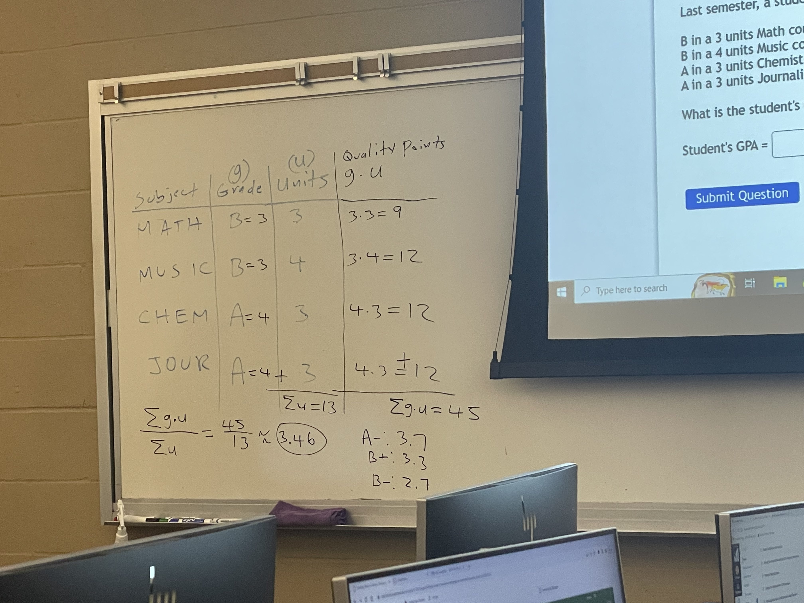
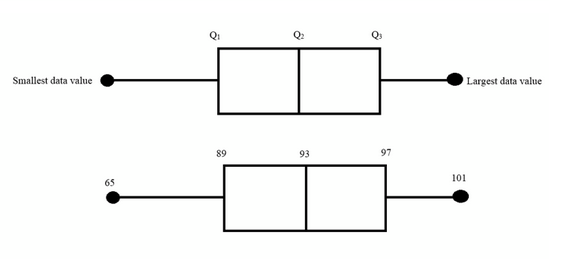

#stats 
# Mean
* ==Sample mean== or $\bar{x}$ of a set of data values $x_i$ is
$$\bar{x} = \sum_{i = 1}^n \frac{x_i}{n} = \frac{1}{n}\sum_{i = 1}^n x_i $$

* ==Population mean== or $\mu$ of a set of data values $x_i$ is 
$$\mu = \sum_{i = 1}^n \frac{x_i}{n} = \frac{1}{n}\sum_{i = 1}^n x_i $$

* In excel, the Average command is the sample mean
Ex: (do this later)
# Median
* The middle value(s) of a data set
* To find, sort the data in ascending order (least to greatest)
* If the set has an *odd* cardinality (number of elements) the median is the middle element
* If the set has an *even* cardinality, find the two middle numbers, then take the mean of those two numbers
Ex: (do this later)
# Mode
* The value which occurs the most in the set
* No modes if there are no repetitions in the data set
* There can be multiple modes of a set
Ex:
1. 1 3 3 4 7. Here, 3 is the mode
2. 1 3 3 4 5 5 7. Here, 3 & 5 are the mode, since both appear the most times which is twice
3. 1 3 3 4 5 5 5 7. Here, 5 is the mode, even tho 3 has multiple occurrences, 5 beats three
4. 1 4 3 5 7 2. Here, there is no mode.

# Midrange
$$ Midrange = \frac{SmallestValue + LargestValue}{2} $$
Ex: 
5 6 7 2 1 3, $Midrange = \frac{1 + 7}{2} = 4$

# Finding the Mean and Modal Class Of A Frequency Distribution
Ex: Find the mean of the frequency distribution and the modal class below.

| Class | Frequency |
| :--: | :--: |
| 4 - 7 | 5 |
| 9 - 12 | 7 |
| 14 - 17 | 1 |
| 19 - 22 | 12 | 

* First, recall the class midpoint formula. Find class midpoint for each [[Stats_chapter_two]]

1. 4 - 7: $\frac{4 + 7}{2} = 5.5$
2. 9 - 12: $\frac{9 + 12}{2} = 10.5$
3. 14 - 17: $\frac{14 + 17}{2} = 15.5$
4. 19 - 22: $\frac{19 + 22}{2} = 20.5$

* Next we find the total frequency by summing all of the four frequencies in the chart $\sum_{} f = 5 + 7 + 1 + 12 = 25$
* We must multiply each frequency by the midpoint $X_m$

| Class | Frequency | Midpoint $X_m$ | $f * X_m$ |
| :--: | :--: | :--: | :--: |
| 4 - 7 | 5 | 5.5 | 5 * 5.5 = 27.5 |
| 9 - 12 | 7 | 10.5 | 7 * 10.5 = 73.5 |
| 14 - 17 | 1 | 15.5 | 1 * 15.5 = 15.5 |
| 19 - 22 | 12 | 20.5 | 12 * 20.5 = 246 | 

* Next, we must obtain the sum from all the products in the table
$$\sum_{} f * X_m = 27.5 + 73.5 + 15.5 + 246 = 362.5$$

* We can now find the mean $\bar{x}$ of the frequency distribution using the following formula
$$\bar{x} = \frac{\sum_ {} f * X_m} {\sum {} f} = \frac{362.5}{25} = 14.5$$

* The modal class is 19 - 22, since this class has the largest frequency (12) out of the other three classes

# Finding a weighted mean
Ex: Find the weighted mean of the price of homes sold in a certain area.

| Home | Number Sold | Price |
| :--: | :--: | :--: |
| A | 5 | 500,000 |
| B | 4 | 1,200,000 |
| C | 7 | 800,000 | 

* We must multiply the number of homes sold by each corresponding price, add the products, and then divide by the total number of homes sold
$$\frac{5 * $500,000 + 4 * $1,200,000 + 7 * $800,000}{5 + 4 + 7} = $806,250$$, which is the weighted mean of the homes sold

## Calculating GPA

# Finding Variance and Standard Deviation
* ==Sample standard deviation== $(s)$ of a set values $(x_i)$ is how much they *deviate* from the sample mean $\bar{x}$
$$s = \sqrt{\sum_{i=1}^n \frac{(x_i - \bar{x})^2}{n - 1}}$$

* The ==Sample Variance==
$$s^2 = \sum_{i=1}^n \frac{(x_i - \bar{x})^2}{n - 1}$$

* The ==Population standard devation== $\sigma$ of a set of values $x_i$ & mean $\mu$ with population size $N$
$$\sigma = \sqrt{\sum_{i=1}^n \frac{(x_i - \mu)^2}{N}}$$

* The ==Population Variance==
$$\sigma^2 = \sum_{i=1}^n \frac{(x_i - \mu)^2}{N}$$

Ex: Find the standard deviation of s = {5, 6, 7, 2, 1, 3}
* First, calculate the sample mean
$$\bar{x} = 4$$
* Then calculate the Variance
$$s^2 = \frac{(5-4)^2 + (6-4)^2 + (7-4)^2 + (2-4)^2 + (1-4)^2 + (3-4)^2}{6 - 1} = \frac{28}{5} = 5.6$$
* Finally, calculate the Standard Deviation
$$s = \sqrt{5.6} = 2.366431913$$

==Chebyshev's Theorem==
The proportion of values from a data set that will fall within "k" standard deviations of the mean will be at least $1 - \frac{1}{k^2}$
where $k > 1$
* Normal Distribution

Ex: Solve using Chebyshev's Theorem. The mean of the distribution is 80, with standard deviation 10
* At least what percentage of values will fall between 60 & 100

* First, notice the gap between the sample mean 80 & data values 60 & 100. The distance from both data values to the mean is 20. This must be true when using Chebyshev's Theorem
* We need to first find the number of standard deviations "k", using the formula
$$ k = \frac{|x - \bar{x}|}{s} $$
* where x is one of the chosen data values
$k = 2$
* By Chebyshev's Theorem. $1 - \frac{1}{4} = \frac{3}{4} = 0.75\%$
* At least 75% of the data values will fall between 60 & 100

Ex: The average number of calories in regular size bagel (all of them) is 240 ($\mu = 240$) with standard deviation 38 ($\sigma = 38$). What range of values will at least 75% of the data lie?
* We first find the number of standard deviations "k" using Chebyshev's theorem. 75% = $\frac{3}{4}$
$$ 1 - \frac{1}{k^2} = \frac{3}{4} => \frac{1}{k^2} = \frac{1}{4} => k^2 = 4 => k = 2 $$
* Now we use the following formulas to find x
$$\mu - k * \sigma = 164$$
$$\mu + k * \sigma = 316$$
* Thus, at least 75% is the proportion of values which will fall between 164 calories and 316 calories

# Range rule of thumb
* Assume the distribution is a normal distribution
* Minimum usual value $\mu - 2\sigma$
* Maximum usual value $\mu + 2\sigma$
* If data falls in the values between $(\mu - 2\sigma, \mu + 2\sigma)$, then its USUAL, otherwise, its UNUSUAL

# Z Scores
* The number of standard deviations $(s, \sigma)$ above and below the mean $(\bar{x}, \mu)$
Sample = $$Z = \frac{x - \bar{x}}{s}$$
Population = $$Z = \frac{x - \mu}{\sigma}$$

# Percentiles
* divides data into 100 groups with about 1% of the values in each group
Percentile corresponding to data value $x$
$$ Percentile = \frac{(Number of Values less than x)}{Total number of data values} * 100 $$
## Finding a data value corresponding to a given percentile
1. Order the data from least to greatest
2. Find data value $c$, using the following formula $$c = \frac{n * p}{100}$$ where $n$ is the total number of data values and $p$ is the percentile
3. If $c$ is NOT a whole number, then ROUND UP to the NEXT whole number. Starting with the least number in the list of values count to that many values of $c$. This will be the data value that corresponds to the given percentile
4. If $c$ is a WHOLE NUMBER, then positions on the list of values to consider are $c$ and $c + 1$. Take the average of these two values to find the data which corresponds to the given percentile

## Quartiles
* Seperated 25% amonst eachother
$Q_1$ is the 25th percentile
$Q_2$ is the 50th percentile
$Q_3$ is the 75th percentile

* ==Interquartile== is $IQR = Q_3 - Q_1$

## Deciles
* Seperated 10% amonst eachother
$D_1$ is the 10th percentile
$D_2$ is the 20th percentile
$D_3$ is the 30th percentile
$D_4$ is the 40th percentile
$D_5$ is the 50th percentile
$D_6$ is the 60th percentile
$D_7$ is the 70th percentile
$D_8$ is the 80th percentile
$D_9$ is the 90th percentile

## Outliers
* Data value(s) that is/our out of sync with the rest of the data set
* Either very small or very large

### Finding Outliers
1. Order data set from least to greatest
2. Find the **Interquartile**
3. Multiply $IQR$ by 1.5
4. Subtract the value from 3. by $Q_1$, add the value from 3. by $Q_3$ $Q_1 - 1.5IQR$, $Q_3 + 1.5IQR$
5. Check any data values smaller than $Q_1 - 1.5IQR$, & any values larger than $Q_3 + 1.5IQR$, those values are outliers

# Box Plots
* chart that contains
    * smallest data value
    * $Q_1$
    * Median
    * $Q_3$
    * largest data value
* 5 number summary

